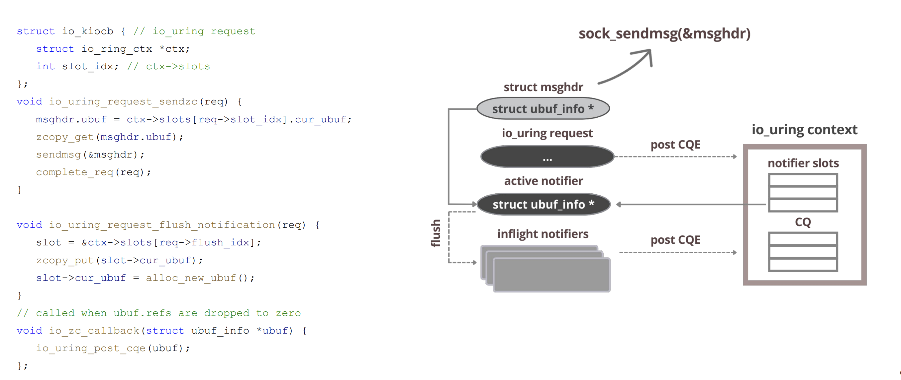
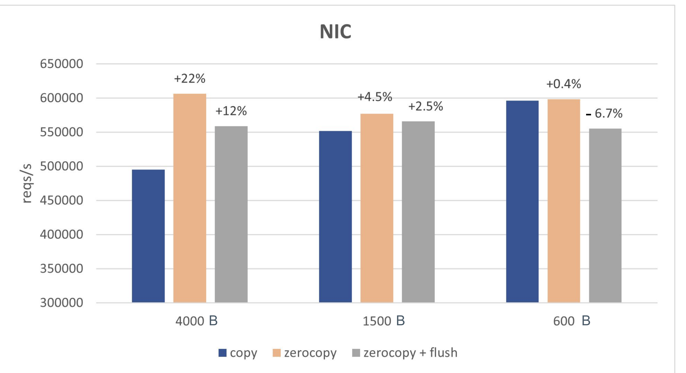
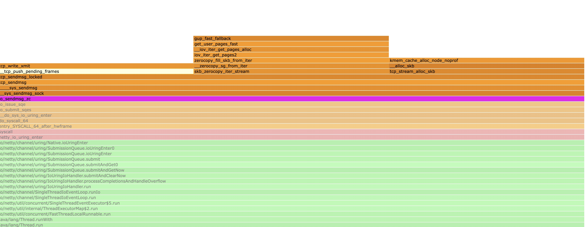

# io_uring 零拷贝发送（TCP）

note: 本文内容基于 Linux 6.1，目标协议为 TCP。

## 前言
在用户进程与内核之间复制大缓冲区通常代价不低。Linux 提供了 sendfile、splice 等“绕过拷贝”的接口，但它们更适用于文件/管道路径；如果需要直接发送用户态内存，实践中更常见的做法是使用 `send(2)` 并配合 `MSG_ZEROCOPY`（同时开启 `SO_ZEROCOPY`），实现用户态到网络栈的数据零拷贝。

但“避免拷贝”并非免费。当前实现依赖页面固定（page pinning）与完成通知：用 pin/引用计数/通知处理的成本，交换掉按字节拷贝的成本。经验上，`MSG_ZEROCOPY` 更容易在写入规模达到约 10KB 以上时体现收益（实际阈值与 NIC/驱动、GSO/TSO、发送模式相关）。

页面固定还会改变系统调用的语义。该机制会在一段时间内使进程与网络栈共享同一缓冲区。与传统复制语义不同，系统调用返回后，进程不能立即重用该缓冲区，否则可能会修改仍在传输中的数据。虽然内核的完整性不会受到影响，但实现不当的应用程序可能会破坏自身的数据流。

具体用法为(省略具体异常处理的short-send处理)

``` c
setsockopt(fd, SOL_SOCKET, SO_ZEROCOPY, &one...)

send(fd, buf, sizeof(buf), MSG_ZEROCOPY);

pfd.fd = fd;
pfd.events = 0;
if (poll(&pfd, 1, -1) != 1 || pfd.revents & POLLERR == 0)
        error(1, errno, "poll");

ret = recvmsg(fd, &msg, MSG_ERRQUEUE);

release(buf)
```
这里非常复杂 
1. 需要在 socket 上开启 `SO_ZEROCOPY`，并在 `send()` 上携带 `MSG_ZEROCOPY`；
2. 需要从 error queue（`MSG_ERRQUEUE`）读取“允许复用/释放”的通知；
3. 通常还需要 `poll/epoll` + `recvmsg(MSG_ERRQUEUE)` 等额外流程来驱动通知获取。

如果应用本身已经有 epoll/reactor，那么 poll/recvmsg 这套流程可以异步化。把同样的语义映射到 io_uring 上更自然：提交 `SEND_ZC` 走发送路径，释放通知由内核在合适时机以 CQE（NOTIF）形式返回。

## io_uring_send_zc

### send_zc流程

io_uring_send_zc在整体流程上非常直观自然，一次IORING_OP_SEND_ZC的投递正常情况下会触发两次cqe的投递，均利用已有的socket发送路径进行实现

1. 第一个 CQE：具有正常 `res` 语义，通常带 `IORING_CQE_F_MORE`，表示一次 `send` 语义完成；
2. 第二个 CQE：`res=0` 且带 `IORING_CQE_F_NOTIF`，表示该批 zero-copy 关联的 buffer 已可安全复用/释放。


由于该流程在内核内闭环完成，不需要额外的 `poll/recvmsg(MSG_ERRQUEUE)` 系统调用，并且内核可以做通知合并等优化，因此 io_uring 的 zero-copy 发送在很多场景下更容易“划算”（更低的使用门槛、更少的用户态开销）。

具体的代码可以参考
``` c
sqe = io_uring_get_sqe(ring);
io_uring_prep_send_zc(sqe, sock_tx, tx_buffer, payload_size, msg_flags, zc_flags);

ret = io_uring_submit_and_wait(ring);

io_uring_cqe_seen(ring, cqe);

ret = io_uring_submit_and_wait(ring, &cqe);

assert(!ret);
assert(cqe->user_data == 1);
assert(cqe->flags & IORING_CQE_F_NOTIF);
assert(!(cqe->flags & IORING_CQE_F_MORE));
io_uring_cqe_seen(ring, cqe);
```

性能表现：
note: flush指的是是否会发布内存释放的通知（即cqe第二段）


具体的执行路径

send路径：
提交线程 issue 对应的sqe，在当前的路径进行内联调用socket_sendmsg走完完整流程后生成一个cqe放到cq中

内存释放的通知：

TX 释放/回退时通过 `ubuf_info->callback` 通知：在软中断/底半部递减 `uarg->refcnt`，最后一个 skb 释放时设置 `notif->io_task_work.func = __io_notif_complete_tw` 并 `io_req_task_work_add(notif)`；随后 `__io_notif_complete_tw()` 在 task_work 中调用 `io_req_task_complete()`，生成带 `IORING_CQE_F_NOTIF` 的 CQE。

task_work 绑定在提交该请求的 task 上：task 返回用户态或在 io-wq 上运行时会被执行；如果无法挂入则回退到 `fallback_work`。
当设置 `IORING_SETUP_DEFER_TASKRUN` 时，task_work 会先进入 ctx 的 `work_llist`，并在后续 `io_uring_enter()`（等待/收割事件）时集中执行，从而把 task_work 的执行节奏收敛到应用的 event loop。



### send_zc使用条件

虽然send调用看起来只是发送一个Buffer到对端，但是实际上还需要内核做一些协议头拼接，checksum计算等工作，但是对于zero copy的情况下这些内核就帮不上忙了，这里就需要卸载给网卡进行操作，所以使用sendzc的前提是有一块功能齐全的网卡否则会回退到内核拷贝的形式

网卡特性：
网卡能力上，`scatter-gather`（或 `tx-scatter-gather` / `tx-scatter-gather-fraglist`）需要开启。这是 TCP zero-copy 的关键门槛之一；无 SG 时 `sk->sk_route_caps` 缺少 `NETIF_F_SG`，`MSG_ZEROCOPY` 会直接走拷贝路径。
GSO/TSO 不是硬性要求，但大多数驱动在支持 SG 的同时也支持硬件 checksum/TSO，从而保持 zerocopy 兼容。驱动会在 TX 完成时触发 MSG_ZEROCOPY 回调（skb_zcopy/uarg），否则 zerocopy 也会被视为不支持

类似于
``` shell
$ ethtool -k eth0
scatter-gather: on
tx-scatter-gather: on
tx-scatter-gather-fraglist: on
tx-checksumming: on
    tx-checksum-ipv4: on
    tx-checksum-ip-generic: on
    tx-checksum-ipv6: on
tcp-segmentation-offload: on
    tx-tcp-segmentation: on
    tx-tcp6-segmentation: on
generic-segmentation-offload: on
...

```

Buffer特性
用户缓冲页会被 iov_iter_get_pages2 针对零拷贝 pin 住并挂成 skb frags（datagram.c (lines 621-715)，被 skb_zerocopy_iter_stream() 调用于 tcp_sendmsg_locked），无特定对齐要求，任意起始地址都行。单个 skb 受 MAX_SKB_FRAGS 限制（不足则切新 skb，仍保持零拷贝，不回退拷贝）。

对齐/页大小：不要求页对齐；跨页会被拆成多个 frag。唯一软限制是 frag 数、sk->sk_wmem_alloc 配额以及网卡的 SG 深度

### send_zc页面开销

零拷贝并不是零额外开销的，其中包括：

1. pin 用户页：get_user_pages_fast() / iov_iter_get_pages*() 之类路径；失败会走更慢的 fallback 路径（页表/锁/缺页等导致）。
2. 维护引用与会计：页引用计数、locked/pinned pages 记账、sk_wmem 相关约束与追踪。
3. zerocopy 完成通知：ubuf_info callback 触发

你在火焰图上有时能看到sendzc明显消耗cpu这是正常的，sendzc 往往增加发送的资源管理开销，但减少拷贝开销

在内存带宽和发送速率归一化之后其性价比是很好的


### send_zc使用的小技巧

#### 发送下一个Buffer的时机

对 TCP 而言，buffer 可复用的通知与 ACK 进度相关；如果等到 NOTIF 才继续发送，会显著拉长发送间隙。

1. 在收到第一个 CQE 后，立即继续提交下一次 send；
2. 同时将当前 send_zc 使用的 buffer 移动到一个中间等待队列（pending / zc-wait queue）；
3. 在后续收到 第二个 CQE（NOTIF） 时，再从该等待队列中取出对应 buffer 并执行真正的释放操作。

注意：需要检查首个 CQE 是否带 `IORING_CQE_F_MORE`。如果没有 `MORE`，通常意味着不会再有 NOTIF，需要在该 CQE 上完成对应 buffer 的释放/复用逻辑，否则可能泄漏。

相关讨论可以参考

https://github.com/netty/netty/issues/15599
https://github.com/axboe/liburing/issues/1462

#### 混合负载的发送

如果不加区分地把所有 iov 都塞进 `IORING_OP_SENDMSG_ZC`，很容易出现“body 的收益被 header 的开销覆盖”。更稳妥的做法是按 buffer 大小分流：小 header 走普通发送，大 body 才进入 zero-copy。

例如阈值为 16KB，待发送队列为 `[4KB, 4KB, 16KB, 32KB, 2KB]`，可以生成 3 个 SQE，并用 `IOSQE_IO_LINK` 串起来以保证顺序：

1. `writev` 发送 `[4KB, 4KB]`
2. `io_sendmsg_zc` 发送 `[16KB, 32KB]`（仅包含满足阈值的 iov）
3. `send` 发送 `[2KB]`

具体讨论可以参考：https://github.com/netty/netty/issues/16086


从表格和折线图可见，在低拆分数量（1-256）区间，patch 与旧版几乎相同，均维持在 23.2k-23.5k QPS 左右，差异极小，说明在“小包聚合程度不高”的场景下该 patch 对吞吐影响不明显。

当拆分数量提高到 1024 时，旧版吞吐明显下降到约 7.5k QPS，而 patch 仍保持在 23.4k QPS 左右，提升约 3.12 倍。拆分数量为 2048 时差异进一步扩大：旧版约 2.6k QPS，patch 约 17.6k QPS，提升约 6.67 倍。这说明在“header + body 混合”的大多数 HTTP 负载里，如果把大量很小的 buffer 也一并纳入 zerocopy 批量发送，会引入额外的元数据/回收通知处理开销，从而限制整体收益。


## 参考资料
- [1] Pavel Begunkov, io_uring: path to zerocopy: https://archives.kernel-recipes.org/wp-content/uploads/2025/01/Pavel_Begunkov_slides.pdf
- [2] Zero-copy network transmission with io_uring: https://lwn.net/Articles/879724/
- [3] Improving IORING_OP_SENDMSG_ZC efficiency for mixed-size buffer workloads: https://github.com/netty/netty/issues/16086