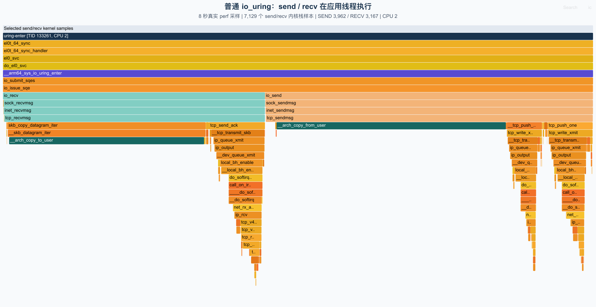
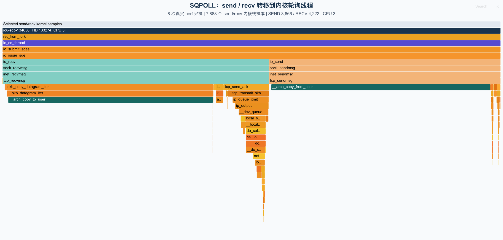
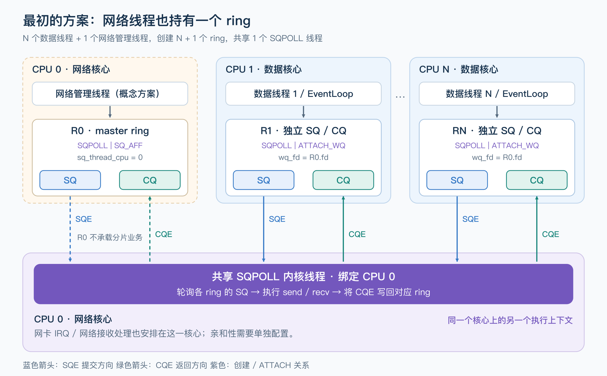
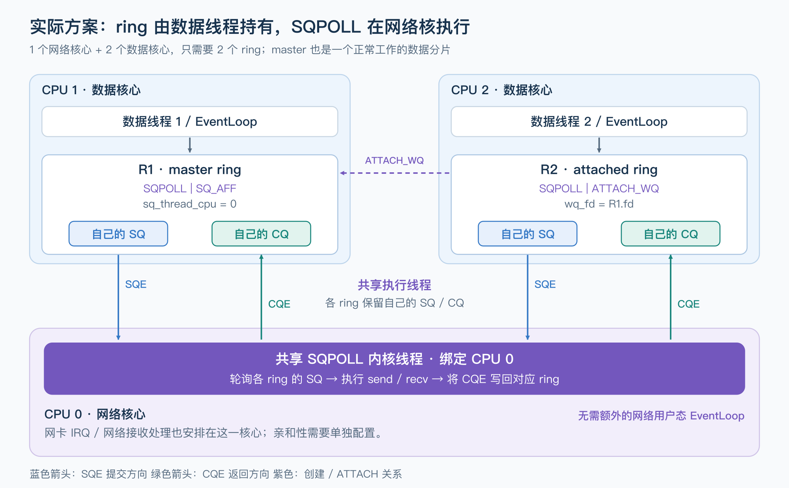

io_uring非对称工作组的一些想法

> 本文由我本人和GPT6 aster max一同完成 相关实验和图片均由本人指导GPT完成

我最近在看[Offloading I/O to Dedicated Cores: An Asymmetric io_uring Backend for Seastar and ScyllaDB](https://www.scylladb.com/2026/07/22/asymmetric-io_uring-backend-seastar/)，
这里提到了一种我从来没有想到过的sqpoll用法

我曾经对sqpoll由一些不恰当的认知，源于我对pre core模型的误读

1. 只是节约一次io_uring_enter的syscall但是要付出一个内核线程的维护开销
2. 在每一个核心上都建立一个io_uring实例的EventLoop，用IORING_SETUP_ATTACH_WQ的方式只使用一个sqpoll进行poll全部的io_uring sq，这样会导致线程多余核心数引入不必要的调度开销
3. sqpoll只是转移了相关inline进来的io操作的调用从submit线程到sqpoll线程罢了，不值得用

怎么说呢，其实这里面只看固有思维带来的per core肯定都是对的，尤其是第3点，请看下面的采集图

下面两张图来自本地 Ubuntu 的实际采样，内核是 `7.0.11`，架构为 ARM64。两次运行使用同一个 TCP loopback 测试程序：每轮通过 io_uring 发送、接收 64 KiB，应用线程固定在 CPU 2，各采样 8 秒。



非 SQPOLL 模式下，选出的 7,129 个收发样本都位于应用线程 `uring-enter` 中。顺着紫色的 `__arm64_sys_io_uring_enter` 向下，可以看到 `io_submit_sqes → io_issue_sqe`，然后分成 `io_send` 和 `io_recv` 两条路径，继续进入 TCP 收发和内存拷贝函数。

而对于sqpoll而言

这次给 ring 加上 `IORING_SETUP_SQPOLL | IORING_SETUP_SQ_AFF`，将 `sq_thread_cpu` 设置为 3，应用线程仍然留在 CPU 2。



选出的 **7,888 个收发样本全部位于 CPU 3 的 `iou-sqp-134656` 线程中**，调用链变成了：

```text
ret_from_fork
  → io_sq_thread
    → io_submit_sqes
      → io_issue_sqe
        → io_send / io_recv
```

下面仍然是相同的内核收发函数，连 `__arch_copy_from_user / __arch_copy_to_user` 也一起转移了过去。这里不涉及再次发起用户态的 `send/recv` syscall。

也就是说，前文提到的 **inline 非阻塞 I/O 尝试，从 submit 线程转到了 SQPOLL 线程**。

读完 ScyllaDB 的文章，我发现这一步转移还有另一层价值：把网络 I/O 集中到少数核心，让数据核心专注于分片计算。只要网络核心有足够的处理能力，就可以减少计算线程承担的网络 I/O 和中断负担。

**先看核心怎么划分。**

这里考虑的场景有几个前提：

1. 中断队列较少，CPU 核心较多，可以留出更多核心做计算。
2. 计算任务能按 shared-nothing 的方式拆成多个分片。
3. 将对应的网络中断和 SQPOLL 线程绑定到同一核心。

为了简化讨论，下面只看一个 NUMA 节点内的分组；多个 NUMA 节点时，再分别在节点内划分网络核心和数据核心。

假设中断队列和 CPU 数目的比例是 **1:3**，那么每组可以按 **1 个网络核心 + 2 个数据核心** 划分：

| 核心 | 数量 | 分工 |
| --- | --- | --- |
| 网络核心 | 1 | 处理网络中断，运行 SQPOLL 线程 |
| 数据核心 | 2 | 各自处理数据分片，执行业务计算 |

**再看收发请求怎么流转。**

如果由网络线程通过 actor 消息向数据线程投递数据，就会增加跨核共享队列的开销。利用 SQPOLL，可以让数据线程直接操作自己的 SQ/CQ。

我最初的想法是：网络管理线程额外持有一个 master ring，数据线程各自持有一个 ring，共享绑定网络核心的 SQPOLL 线程。运行时的职责分成两部分：

- **数据线程**：填写自己的 SQ，消费自己的 CQ，继续处理分片数据。
- **SQPOLL 线程**：轮询各个 SQ，执行内核收发操作和就绪后的重试，将完成事件写回对应的 CQ。

SQPOLL 保持活跃时，数据线程操作 SQ/CQ 不需要 syscall；空闲时，也可以通过 `io_uring_enter` 阻塞等待。这样就能让网络中断与收发执行尽量留在网络核心，减少对数据线程的干扰。



先把这个想法画出来：网络管理线程持有 `R0`，创建绑定 CPU 0 的 SQPOLL 线程；数据线程分别持有 `R1 ... RN`，创建时通过 `IORING_SETUP_SQPOLL | IORING_SETUP_ATTACH_WQ` 和 `wq_fd = R0.fd` 加入同一组。

这样总共有 `N + 1` 个 ring，但只有一个 SQPOLL 线程。每个数据线程仍然只往自己的 SQ 中填入请求、从自己的 CQ 中收割完成事件，共享的是内核执行线程，SQ/CQ 并没有合并成一个供所有数据线程争用的大队列。图中 CPU 0 上的网络管理线程和 SQPOLL 内核线程是两个不同的执行上下文，只是绑定在同一个核心上。

其实这里还有一点优化，我思维惯性地把核心和线程两个概念绑定在一起，其实这是不对的，按照上面的想法一个组中一个网络核心，两个数据核心，我们应该是拥有3个io_uring核心对么？

如果我说只需要两个呢？

实际的需求只是要求sqpoll线程运行在中断绑定的核心上而已，所以我们完全可以只用两个io_uring分别为两个数据核心持有，其中一个我们叫它master io_uring,他负责创建sqpoll线程并设置亲核性到中断核心上，另外一个只需要attach master io_uring借即可




以一个网络核心、两个数据核心为例，CPU 1 上的数据线程创建 `R1`，设置 `IORING_SETUP_SQPOLL | IORING_SETUP_SQ_AFF` 和 `sq_thread_cpu = 0`。CPU 2 上的数据线程创建 `R2`，设置 `IORING_SETUP_SQPOLL | IORING_SETUP_ATTACH_WQ`，并让 `wq_fd` 指向 `R1`。

`R1` 就是 master ring，但它照常承载 CPU 1 上的数据分片的收发。master 的含义只是它先创建了供本组共享的内核执行资源，不代表它必须由一个网络用户态线程持有，也不代表其他 ring 的请求需要先转发到它的 SQ 中。CPU 0 上的 SQPOLL 线程直接轮询 `R1`、`R2` 各自的 SQ，并将完成事件写回请求所属 ring 的 CQ。

这也对应了 [Seastar 的实现](https://github.com/scylladb/seastar/blob/56fd8eeb52d730fe5f323b1c3b9ef2919c7d258c/src/core/reactor_backend.cc#L2336)：每组的第一个应用 shard 被选为 master；[创建 master 和 attached ring](https://github.com/scylladb/seastar/blob/56fd8eeb52d730fe5f323b1c3b9ef2919c7d258c/src/core/reactor_backend.cc#L2128) 时分别设置上述参数。它还通过 `io_uring_register_iowq_aff()` 设置共享 io-wq worker 的亲和性，图中只展开了 SQPOLL 这条执行路径。

这里的“不需要 syscall”有一个边界：SQPOLL 保持活跃时，应用可以只操作共享内存中的 SQ/CQ；如果它因空闲而休眠，提交方看到 `IORING_SQ_NEED_WAKEUP` 后，仍要调用带 `IORING_ENTER_SQ_WAKEUP` 的 `io_uring_enter`。应用主动阻塞等待完成事件时也会进入内核。因此无需另设一个网络用户态线程定时调用 `enter`，但数据线程也并非永远不会调用它。这个行为在 [io_uring_setup 的 SQPOLL 说明](https://man7.org/linux/man-pages/man2/io_uring_setup.2.html)中有明确描述。

似乎看起来没什么问题？绝佳的亲和性，无锁的方案设计，干净的架构，但是文章里面提到了两点很有意思

>  If your workload does more than a few microseconds of compute per request alongside network I/O — and you’re running roughly multiple application cores per networking core — then strongly consider benchmarking this against your current setup

和

>  It turns out that the single networking core spends around 40-50% of its cycles on memory copying. This is the necessary buffer copying that the Linux kernel performs while handling I/O related operations

这种后端对比对称性的per core你会发现，我们极大的减少了处理网络的线程，也就是把网络IO相关syscall的内存拷贝集中到了少数的核心上，本来这些都是大家平摊的，这就导致了网络核心的过载

我想零拷贝可以作为缓解网络核心拷贝压力的后续方向，但发送和接收需要分别讨论。目前 io_uring 的零拷贝接收依赖 DEFER_TASKRUN，无法直接用于这里的 SQPOLL 后端，还需要内核支持或调整 I/O 驱动方式，同时满足网卡等接收链路条件。
