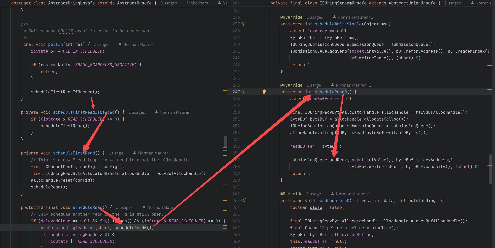
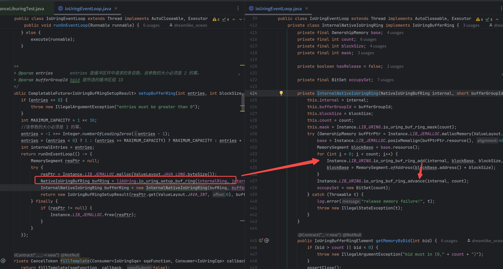

# io_uring,Memory以及Procator的Socket IO

> 本文可能需要一点点的io_uring的基础知识，这里提供一份快捷查询[手册](https://nick-black.com/dankwiki/index.php/Io_uring)

## 由内核直接支持的Procator模式
首先我们要明确下Reactor和Procator的概念，前者是基于就绪事件的，后者是基于完成事件的，最简单的一个区分办法就是内核到底为开发者做到哪一步？基于就绪事件的内核只会通知哪些文件描述符已经就绪，而基于完成事件的内核会通知哪些文件描述符已经完成了IO操作。
用一个 两个对外Api完全一致 但是底层实现不同的例子来说明这两者的区别
``` JavaScript
//reactor例子
async function recv_reactor(buffer, len) {
//一般这个是交给EventLoop(比如说Epoll)来控制的 用于回调事件就绪
 awiat wait_poll_in();
 return recv(this.socketFd, buffer, len, 0);
}

//Procator例子
async function recv_proactor(buffer, len) {
//直接向内核提交任务 等待回调
 return await recv(this.socketFd, buffer, len, 0);
}

```

## 内存踩踏

> 这里补充一个我司的基于io_uring的异步runtime——monoio的[介绍](https://rustmagazine.github.io/rust_magazine_2021/chapter_12/monoio.html),以补充生产环境中io_uring的应用

从上方的例子我们可以看到看似两者的buffer生命周期是从调用recv_*开始到recv_*调用结束,实则不然，请读者考虑一个场景——取消对应操作，reactor本质上就绪和读取是同控制流的 syscall 就是用户做的，陷入 syscall 期间本来就无法操作 buffer，所以可以保证其持续有效直到 syscall 返回，用户可以在大部分时候直接取消这个操作然后释放掉内存，因为是否读取是用户控制的

而基于io_uring实现的Procator则不然，你的就绪事件和读取操作是完全由内核完成的，本质上和用户态操作是两个不同的控制流，所以必须保证内存在整个操作期间是有效的，这就要求用户在提交任务到任务完成这个期间，就要保证内存是有效的，如果没有这个保证则在一些场景下是非常严重的，比如说用户提交了一个读取操作只是直接取消了而没有校验是否允许取消，就释放掉了内存，如果这块内存被用户程序复用，本质上就是内核态和用户态并发写同一块内存，这就是一个非常严重的未定义行为。

所以我参考了monoio的设计，提供了一个基于约定的内存安全的设计入参为OwnershipMemory，当正常从CQE读取到结果时就把OwnershipMemory的所有权交给用户，用户可以自由的释放内存，当异常时直接释放内存，这样就大体上避免了内存的踩踏问题

``` java
    default CancelableFuture<BufferResult<OwnershipMemory>> asyncRead(OwnershipMemory buffer, int len, int offset) {
        return (CancelableFuture<BufferResult<OwnershipMemory>>) owner()
                .asyncOperation(sqe -> Instance.LIB_URING.io_uring_prep_read(sqe, readFd(), MemorySegment.ofAddress(buffer.resource().address()), len, offset))
                .thenApply(cqe -> new BufferResult<>(buffer, cqe.getRes()))
                .whenComplete(buffer::DropWhenException);
    }
```

## Socket IO 和 内存池

正如上面提到的我们需要在异步操作的完整生命周期里面保证内存的有效，也就是说此时这块内存相当于被OS“占用”，对于内存池来讲内存分配和内存回归的速率最好是均衡的以避免内存池的内存不足的问题，当大量内存被占用无法及时回归时就会造成性能问题，那么这里我就要提出一个小小的思维训练，同样是占用用户态的内存，文件IO和网络IO两者的使用特征是否也有区别呢？

其实是有的，注意我们之前提到的`内存分配和内存回归的速率最好是均衡的`的这个建议，文件IO占用某一块内存的时间是可以预测的，他肯定是可以在有限的时间归还内存的，但是网络IO则不然，回想下经典的C10K问题以及多路复用的一个小前提——大部分连接并不会同时活跃，甚至说极端一点有些连接建立后甚至永远不会通知存在可读事件，也就是说`await recv(buffer, len, flag)`持有的buffer所有权时间是无法预测的，如果继续保持接收到链接后直接投递一个异步的recv操作那么就会带来可观的内存浪费，这就是Procator模型下一个网络IO与内存池配合的不太好的小地方。

当然这里有个简单的解决方案就是读超时设计，建立连接/读取数据后如果超过一定时间没有对应的CQE出现就直接投递取消操作，将对应的内存让OS归还给用户，虽然有点复杂但是多少缓解了一些问题

## io_uring的解决方案

### 来自Netty的智慧
我们先来点题外话，看看Netty的io_uring适配



这一张图就可以说明Netty对于Socket的封装，本质上还是基于Proactor封装出来Reactor模式，其整体流程是先投递[poll op](https://man.archlinux.org/man/io_uring_prep_poll_add.3.en)让io_uring监听可读事件，等其在CQE中被读到后再投递[recv op](https://man.archlinux.org/man/extra/liburing/io_uring_prep_recv.3.en),由于此时内核已经通知了用户有数据可读，所以此时recv在[io_uring_enter](https://man.archlinux.org/man/io_uring_enter.2.en)这个系统调用之后就可以在CQ中发现对应的CQE,这里的好处是OS持有这段内存的时间非常短且跟用户的控制流是同步的，而且也能利用上io_uring批量系统调用的特性，缺点是需要两个OP且没有完全利用上io_uring强大的剩余特性。

我们这里就可以得出一个解决方案和他的几个变体
> 仅供参考 实际上不建议这么这么做


- 原型
  - 投递poll op来检测是否有数据可读
  - 等到第一个poll_in事件被完成时才开始投递recv op
  - recv同步返回后再次投递poll op 如此循环
    
- 变体1
  - 先投递poll op来检测是否有数据可读
  - 等到第一个poll_in事件被完成时才开始投递recv op
  - recv同步返回后再次投递recv op 如此循环
- 变体2
  - 基本同变体1
  - 但是额外统计recv从投递到在cqe中发现它完成的时间，如果超过一定时间则认为其并不是活跃的链接，于是就回退到poll+recv的模式

### 来自io_uring的小技巧

> 这一节可以参考Axboe写的[io_uring and networking in 2023](https://github.com/axboe/liburing/wiki/io_uring-and-networking-in-2023#provided-buffers)

前面提到的内存池实际上是用户的内存池，如果我们可以将内存池交给内核维护，让内核自己选择用哪块内存来接收数据，然后在操作完成后将这块“托管内存”的所有权再归还给用户态，用户态用完再交给内核，这样即使每个连接过来都投递了一个recv操作也不会造成内存的浪费，这就是io_uring的[IOSQE_BUFFER_SELECT](https://lwn.net/Articles/813311/)机制

我们先来看一个例子，先简单介绍下这东西怎么使用



首先找io_uring注册下你的buffer_ring,给他一个你觉得有意义的Buffer Group Id,然后使用io_uring_buf_ring_add将一些内存加入到这个buffer_ring中记得给每一个打个意义的buffer Id，最后用io_uring_buf_ring_advance表示这块内存就交给内核使用了！

接下来我们就可以让某些操作利用上这个特性了

``` java
(CancelableFuture<OwnershipMemory>) owner().asyncOperation(sqe -> {
            Instance.LIB_URING.io_uring_prep_recv(sqe, fd, MemorySegment.NULL, len, flag);
            //这个flag
            sqe.setFlags((byte) (sqe.getFlags() | IoUringConstant.IOSQE_BUFFER_SELECT));
            //以及刚才你注册给io_uring的Buffer Group Id
            sqe.setBufGroup(bufferRing.getBufferGroupId());
        }).thenCompose(cqe -> {
            int syscallResult = cqe.getRes();
            if (syscallResult < 0) {
                return CompletableFuture.failedFuture(new SyscallException(syscallResult));
            } else {
                int bid = cqe.getBid();
                //从cqe提取出来Buffer Id,然后从bufferRing中取出对应的Buffer，这块内存就是内核写好的内存并把它交给你了
                IoUringBufferRingElement ringElement = LambdaHelper.runWithThrowable(() -> bufferRing.removeBuffer(bid).get());
                return CompletableFuture.completedFuture(IoUringSelectedReadableFd.borrowUringBufferRingElement(ringElement, syscallResult));
            }
        });
```

当你不需要的时候就可以重复add,advance操作把对应的内存继续给内核使用，是不是很像是内存池分配和内存归还？更妙的是这一套完全可以套用到我们之前的OwnerMemory抽象，当我Drop这个OwnerMemory时就是将其归还给内核。

我们这里就可以得出一个解决方案和他的几个变体
> 仅供参考

- 原型
  - 预申请一大块内存丢给内核
  - 每次recv都使用IOSQE_BUFFER_SELECT机制

- 变体1
  - 只声明BufferRing的大小但是并不注册对应的内存进去
  - 惰性地注册内存进去，在捕获到有recv返回了 -ENOBUFS 后再注册内存进去后重试recv操作

- 变体2
  - 申请并注册n个不同规格的BufferRing，比如说都是1KB大小的，2KB大小，4KB大小的不同规格池子
  - 参考Netty的allocateHandle机制动态选择下一次recv该使用哪个规格的BufferRing

- 变体3
  - 将1和2结合起来


## 歪门邪道

有一些文章可能会把epoll和io_uring相比较，得出一些诸如`io_uring是Epoll的替代品` 或者 `io_uring竟不如epoll`的结论，我们先不讨论哪个是对的，从客观上讲io_uring上手难度远高于epoll,因为包含了大量的特殊op和特殊flag,而且对于低版本内核支持的并不是太好，但是epoll则是完全不支持文件IO,Linux AIO文件IO泛用性也不太行。那么有没有什么办法让我们这些成年人全都要呢？

其实是有的[io_uring_register_eventfd](https://man.archlinux.org/man/extra/liburing/io_uring_register_eventfd.3.en),这个api的作用是将某个eventfd注册到某个io_urig实例上，每当CQ上有CQE出现时就会增加对应的eventfd计数，而eventfd又是pollable，所以有这么一个邪门玩法，文件IO走io_uring然后将对应eventfd注册到epoll上，这样就可以在epoll上监听io_uring的事件了，epoll照常监听各种网络IO事件，当监听到这个eventfd可读时再去收割CQE，就做到了基于epoll的文件IO和网络IO的统一

这样我们就不用头疼Proactor的网络IO的内存生命周期问题了，而且还能得到支持poll，支持Buffered Read以及Direct IO的异步能力！

## 私货部分

灵感来源[monoio](https://github.com/bytedance/monoio)

个人项目[PanamaUring](https://github.com/dreamlike-ocean/PanamaUring),使用panama api为java提供io_uring的绑定而无需使用jni绑定，同时统一文件IO和网络IO的模型，提供一套易用的异步IO API