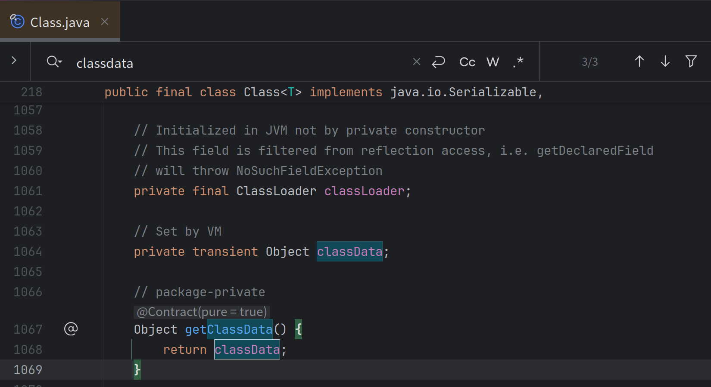

## 基于JVM优化的单例模式

### 传统单例模式

我们很多时候期望使用全局的惰性单例来实现各种需求，其中出现了经典的基于DCL和类加载机制两种比较常见的模板代码。

一个经典的DCL是这样的

```SQL
public static class DCLStableValue<T> implements StableValue<T> {
    public final Supplier<T> factory;

    private volatile T cache;

    public DCLStableValue(Supplier<T> factory) {
        this.factory = factory;
    }


    @Override
    public T get() {
        if (cache != null) {
            return cache;
        }

        synchronized (this) {
            if (cache != null) {
                return cache;
            }
            return cache = factory.get();
        }
    }
}
```

而对于类加载机制实现全局的惰性单例则是

```SQL
private static final StableValue<String> classLoad = new StableValue<String>() {

    private static class InternalClass {
        private static final String lazyValue;

        static {
            LockSupport.parkNanos(TimeUnit.SECONDS.toNanos(1));
            lazyValue = UUID.randomUUID().toString();
        }
    }

    @Override
    public String get() {
        return InternalClass.lazyValue;
    }
};
```

其中DCL涉及到大量的volatile读，显然在多线程情况下会有性能损失，而类加载机制虽然最终相当于直接plain访问变量（由类加载器机制保证可见性）但是不够灵活，无法像DCL一样自由选择 `factory` 。

虽然我们纸面分析了这些优劣，但是还应该通过数据说话，跑个分看下。

```SQL
Benchmark                                     Mode  Cnt        Score        Error  Units
StableValueBenchmark.testClassInit           thrpt   10  1522698.845 ± 236056.147  ops/s
StableValueBenchmark.testDCL                 thrpt   10   256534.744 ±  25053.302  ops/s
StableValueBenchmark.testPlain               thrpt   10  1531563.936 ± 209274.818  ops/s
```

很明显testClassInit和直接获取一个常量的性能是差不多的，那么有没有综合可以自定义初始化逻辑而且性能也比较好的方案呢？

### invokedynamic

很多写Java的同学听说过invokedynamic这个字节码（下称indy），实际上现在的Java lambda，字符串拼接甚至是模式匹配都是基于这东西做的，它的核心特点在于可以支持惰性绑定调用点而且是线程安全的，只有代码执行到对应的indy的字节码时再去调用一个特殊的方法（下称bootstrapMethod，BSM）来指定一个CallSite作为真实链接到的方法，而这个BSM的具体实现是可以自定义的，所以就给了我们很大的操作空间，下方是一个很简单的BSM实现。

```SQL
    public static ConstantCallSite indyFactory(MethodHandles.Lookup lookup, String name, MethodType type, Object... args) throws NoSuchFieldException, IllegalAccessException {
        Class<?> aClass = lookup.lookupClass();
        Supplier supplier = MethodHandles.classData(lookup, DEFAULT_NAME, Supplier.class)
        return new ConstantCallSite(MethodHandles.constant(type.returnType(), supplier.get()));
    }
```

MethodHandles.*constant* 实际上是一个调用会返回一个常量值的Methodhandle，如果你不太了解什么是Methodhandle，那么你可以简单的把它理解成Java的函数指针，它本质上就是描述一个Java方法是怎么被JVM链接并且调用的。

> A ConstantCallSite is a CallSite whose target is permanent, and can never be changed. An invokedynamic instruction linked to a ConstantCallSite is permanently bound to the call site's target.

ConstantCallSite这个作为CallSite的一个子类有个好处在于可以在调用点被JIT直接内联展开，直接原地访问。然后我们就可以利用字节码工具（这里使用的是Java21引入的ClassFile API），动态生成一个接口的实现，在对应的方法里面填入indy字节码，使其引导到我们这个BSM上。

那么其实这里还有个新东西`MethodHandles::classData`这是什么？这个就是一个动态常量，是一个跟java.lang.class相绑定的东西，当我们在运行时通过Lookup定义一个类的时候就可以通过传入这个东西，隐式传递一个运行时引用

再通过`MethodHandles::classData`获取出来，具体可以参考这个https://bugs.openjdk.org/browse/JDK-8256214?attachmentViewMode=list



那么这段字节码该如何写呢？

```java
        byte[] classByteCode = classFile.build(ClassDesc.of(className), cb -> {
            cb.withInterfaceSymbols(ClassDesc.of(StableValue.class.getName()));
            cb.withMethodBody(ConstantDescs.INIT_NAME, ConstantDescs.MTD_void, AccessFlags.ofMethod(AccessFlag.PUBLIC).flagsMask(), it -> {
                it.aload(0);
                it.invokespecial(CD_Object, INIT_NAME, MTD_void);
                it.return_();
            });
            cb.withMethodBody(
                    "get",
                    MethodTypeDesc.of(ClassDesc.of(Object.class.getName())),
                    AccessFlags.ofMethod(AccessFlag.PUBLIC, AccessFlag.SYNTHETIC).flagsMask(),
                    it -> {
                        //这里就是invokedynamic字节码
                        it.invokeDynamicInstruction(
                                DynamicCallSiteDesc.of(
                                        MethodHandleDesc.ofMethod(
                                                DirectMethodHandleDesc.Kind.STATIC, StableValueGenerator.class.describeConstable().get(), "indyFactory",
                                                INDY_MTD
                                        ),
                                        "get",
                                        MethodType.methodType(Object.class).describeConstable().get()
                                )
                        );
                        it.returnInstruction(TypeKind.from(Object.class));
                    }
            );
        });
        MethodHandles.Lookup lookup = MethodHandles.lookup();
//在这里定义隐藏类和初始化classdata
        Class<?> aClass = lookup.defineHiddenClassWithClassData(classByteCode, factory, false).lookupClass()

        return ((StableValue) aClass.newInstance());
```

对应产物反编译就是这样的：

```Java
// class version 66.0 (66)
// access flags 0x1
public class io/github/dreamlike/stableValue/StableValueImpl0 implements io/github/dreamlike/stableValue/StableValue {


  // access flags 0x1
  public <init>()V
    ALOAD 0
    INVOKESPECIAL java/lang/Object.<init> ()V
    RETURN
    MAXSTACK = 1
    MAXLOCALS = 1

  // access flags 0x1001
  public synthetic get()Ljava/lang/Object;
    INVOKEDYNAMIC get()Ljava/lang/Object; [
      // handle kind 0x6 : INVOKESTATIC
      io/github/dreamlike/stableValue/StableValueGenerator.indyFactory(Ljava/lang/invoke/MethodHandles$Lookup;Ljava/lang/String;Ljava/lang/invoke/MethodType;[Ljava/lang/Object;)Ljava/lang/invoke/ConstantCallSite;
    ]
    ARETURN
    MAXSTACK = 1
    MAXLOCALS = 1
}
```


而且用起来也很简单，其实除了ClassFile API之外都是Java8可用的，换个字节码库就能运行在Java8上得到一个通用的高性能惰性单例工具

```SQL
private static final StableValue<String> valueFinal = StableValue.of(() -> {
    LockSupport.parkNanos(TimeUnit.SECONDS.toNanos(1));
    return UUID.randomUUID().toString();
});
```

### ConstantDynamic

ConstantDynamic是一个特殊的字节码，其储存在常量池中，当被load到栈顶时会执行BootstrapMethod，然后被jit将返回值缓存起来，之后再次调用时直接返回缓存的值，这个特性正好可以用于实现高性能的懒加载单例。

>ConstantDynamic是什么具体可以参考[JEP 309: Dynamic Class-File Constants](https://openjdk.org/jeps/309) 以及 [hands-on-java-constantdynamic](https://www.javacodegeeks.com/2018/08/hands-on-java-constantdynamic.html)

它对应的BSM其实跟invokedynamic的BSM很像，只不过把MethodType换成了对位的Class

```java
    public static Object condyFactory(MethodHandles.Lookup lookup, String name, Class type) throws NoSuchFieldException, IllegalAccessException {
        Class<?> aClass = lookup.lookupClass();
        Supplier supplier = MethodHandles.classData(lookup, DEFAULT_NAME, Supplier.class);
        return supplier.get();
    }
```

对应的字节码写起来更简单了

```java
        byte[] classByteCode = classFile.build(ClassDesc.of(className), cb -> {
            cb.withInterfaceSymbols(ClassDesc.of(StableValue.class.getName()));
            cb.withMethodBody(ConstantDescs.INIT_NAME, ConstantDescs.MTD_void, AccessFlags.ofMethod(AccessFlag.PUBLIC).flagsMask(), it -> {
                it.aload(0);
                it.invokespecial(CD_Object, INIT_NAME, MTD_void);
                it.return_();
            });
            cb.withMethodBody(
                    "get",
                    MethodTypeDesc.of(ClassDesc.of(Object.class.getName())),
                    AccessFlags.ofMethod(AccessFlag.PUBLIC, AccessFlag.SYNTHETIC).flagsMask(),
                    it -> {
                        it.constantInstruction(
                                DynamicConstantDesc.of(
                                        ConstantDescs.ofConstantBootstrap(StableValueGenerator.class.describeConstable().get(), "condyFactory", Object.class.describeConstable().get())
                                ));
                        it.returnInstruction(TypeKind.from(Object.class));
                    }
            );
        });
//define和classdata部分与invokedynamic实现一致
```

生成出来的字节码（节选）

```java
  public io.github.dreamlike.stableValue.StableValueImpl2();
    descriptor: ()V
    flags: (0x0001) ACC_PUBLIC
    Code:
      stack=1, locals=1, args_size=1
         0: aload_0
         1: invokespecial #8                  // Method java/lang/Object."<init>":()V
         4: return

  public java.lang.Object get();
    descriptor: ()Ljava/lang/Object;
    flags: (0x1001) ACC_PUBLIC, ACC_SYNTHETIC
    Code:
      stack=1, locals=1, args_size=1
         0: ldc           #21                 // Dynamic #0:_:Ljava/lang/Object;
         2: areturn
}
BootstrapMethods:
  0: #17 REF_invokeStatic io/github/dreamlike/stableValue/StableValueGenerator.condyFactory:(Ljava/lang/invoke/MethodHandles$Lookup;Ljava/lang/String;Ljava/lang/Class;)Ljava/lang/Object;
    Method arguments:
```

### 性能

可以直接参考https://github.com/dreamlike-ocean/StableValue的实现

```
并发线程数目为5
Benchmark                                                               Mode    Cnt        Score       Error  Units
stableValue.Benchmark.StableValueBenchmarkCase.testClassInit            thrpt   10  1998369.352 ± 32731.935  ops/s
stableValue.Benchmark.StableValueBenchmarkCase.testDCL                  thrpt   10   472392.857 ± 10495.215  ops/s
stableValue.Benchmark.StableValueBenchmarkCase.testIndyStabValue        thrpt   10  1996429.795 ± 32976.993  ops/s
stableValue.Benchmark.StableValueBenchmarkCase.testIndyStabValueCody    thrpt   10  1998819.221 ± 29030.771  ops/s
stableValue.Benchmark.StableValueBenchmarkCase.testIndyStabValueHidden  thrpt   10  2006979.049 ± 21622.126  ops/s
stableValue.Benchmark.StableValueBenchmarkCase.testPlain                thrpt   10  2015192.566 ± 16183.806  ops/s

```


### 醋

其实写了这么多，都是为了铺垫这样一个Java新特性——StableValue，一种更方便且性能更好的的惰性初始化，让@Stable这个注解更适合开发者使用

https://openjdk.org/jeps/8312611

期待这个特性合入master，pr可参考https://github.com/openjdk/jdk/pull/19625

### 

