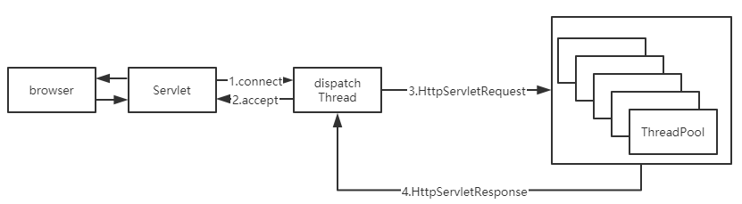
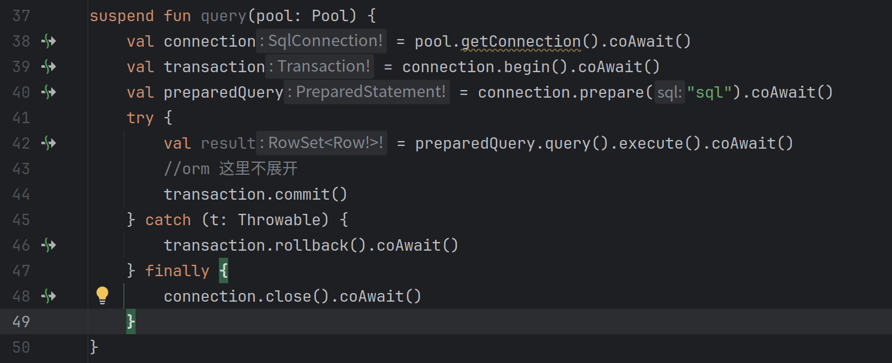
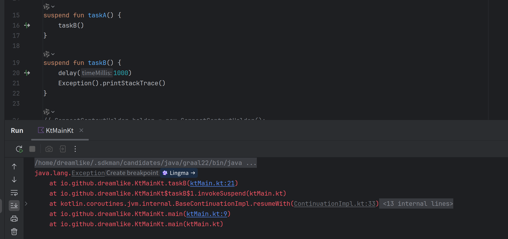
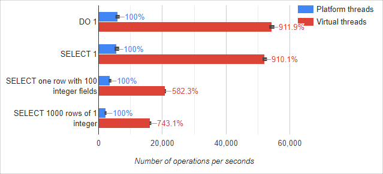
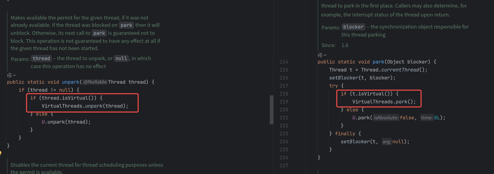
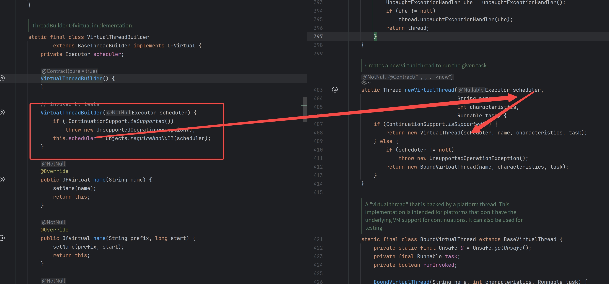
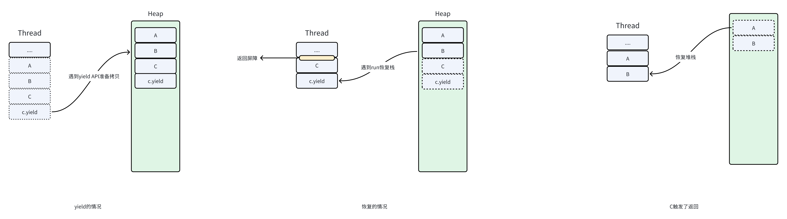
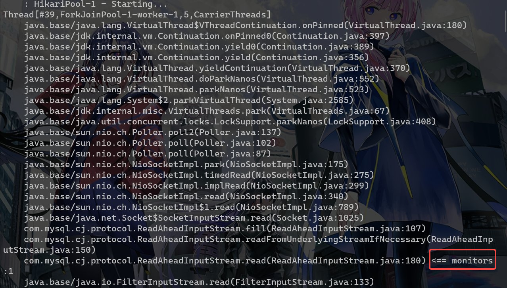
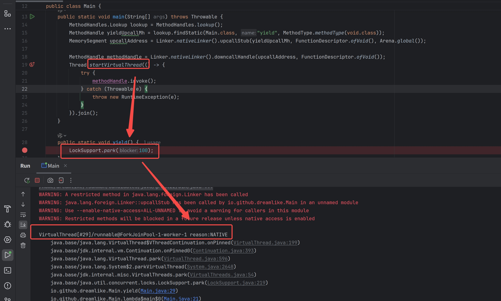
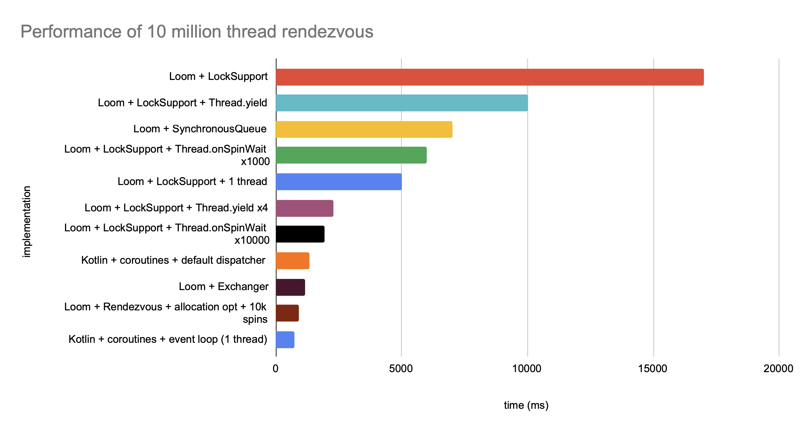

# 虚拟线程那些事

本文涉及的Java版本为JDK21以及[loom ea](https://github.com/openjdk/loom)版本，会在具体提及时标明是EA版本还是主线版本

姐妹篇[jvm为什么需要有栈协程](为什么jvm需要有栈协程.md)

术语对照表

| 术语                                   | 解释                                                         |
| -------------------------------------- | ------------------------------------------------------------ |
| 平台线程                               | 指的是当前OS支持的线程，pthread就是一个典型的平台线程，直接通过java.lang.Thread构造器获取的也正是平台线程 |
| 虚拟线程                               | 是Java抽象出来的，API视图与平台线程保持一致的有栈协程API     |
| Continuation以及delimited continuation | 指的是当前代码控制流剩下的部分，后者则是具有边界的前者       |
| 并发单元                               | 处理并发请求的最小单位，可以是线程也可以是协程               |
| CPS                                    | Continuation Passing Style 的缩写 是一种编译器语法糖，多用于实现async/await将异步代码自动改写为状态机形式，是大部分无栈协程的实现 |
| oneshot                                | 单次注册，只关注一次事件的触发                               |
| oopMaps                                | 描述当前栈帧上有哪些引用的元数据                             |

## 过去是怎么做的

以 Web 服务器为例，当前最广泛的JavaWeb接口模型是Servlet，他是基于线程池处理请求的将请求的生命周期与某一个线程相绑定，虽然写起来很直观但是性能受限于当前硬件平台的线程调度能力，其无法轻易地通过扩展线程数目增加当前服务的吞吐量，只能够使用成本更高的硬件扩容的方案来实现增加吞吐的需求



当然为了解决这种我们有另外一种编程范式，Reactive/异步编程，其将并发单元抽象为一个又一个future,手动将控制流拆散，然后进行声明式组装。具体一点则是多个连接可以挂在同一个 epoll 上，一起等待。有任何一个连接满足需求时就会返回所有 ready 的 fd 对应的消息传递给上层。


但是写起来的体验会十分糟糕，需要手动管理大量的状态，在一个大型应用里基本是不现实的。例如下面这个例子，这是一个[Vertx](https://vertx.io/)的数据库开启事务，执行SQL,提交事务的一个Reactive风格的代码，即使是基本的控制流，如循环和try/catch，也需要在Reactive的DSL中重建，有些流行的Reative库甚至有数百种方法，即使是使用kotlin提供的无栈协程也存在一些问题。



虽然无栈协程改写之后能够保持reactive的高性能，也提供了个更好的书写和观看体验，但是由于其本质上是编译期的[CPS](https://fleurer.github.io/2020/07/04/kotlin-coroutine-cps/)语法糖，存在堆栈信息丢失的问题。Kotlin coroutine本质上是回调的语法糖，其捕获的是栈上保存的一些堆上状态，而普通的线程切换捕获的是当前的完整堆栈。



而且还存在[函数染色](https://timothya.com/learning/what-color-is-your-function/)问题，JVM生态的程序并不是像node.js一样从头到尾都是async的所以改造成本非常大，而且reactive生态和servlet生态又无法很好的兼容。

## 现在是怎么做的

### VirtualThread的引入

为了解决这个问题，OpenJdk Group提出了一个计划，称之为[Project Loom](https://wiki.openjdk.java.net/display/loom/Main),也就是将用户态轻量级线程引入到JVM中，保持写同步代码的便利性，但是也能获得写异步代码的大部分性能，即我们今天提到的Java的有栈协程——VirtualThread。

为什么叫Loom（织布机）呢？因为线程叫Thread，想要将编写并发程序就像是纺纱机纺线一样规矩和简单

只要开启一个虚拟线程 就像是goalng写一个go关键字一样简单（甚至于你可以用kotlin模拟出一个go关键字[goroutine.kt](https://github.com/dreamlike-ocean/codepieces/blob/main/goroutine.kt)），旧有生态的bio原地从阻塞平台线程升级到阻塞虚拟线程，再也不需要开那么多平台线程来处理并发了。

```Java
Thread.startVirtualThread(() -> {
    System.out.println("Hello, Loom!");
});
```

对于servlet容器接入也很简单，只需要升级内嵌tomcat版本以及替换默认的线程池就可以将Web服务改造为虚拟线程驱动。

```Java
@Configurationpublic
class TomcatConfiguration extends TomcatWebServerFactoryCustomizer {
    public TomcatConfiguration(Environment environment, ServerProperties serverProperties) {
        super(environment, serverProperties);
    }

    @Override
    public void customize(ConfigurableTomcatWebServerFactory factory) {
        factory.addProtocolHandlerCustomizers(protocolHandler -> protocolHandler.setExecutor(Executors.newVirtualThreadExecutor()));
    }
}
```

### VirtualThread性能

这里引用MariaDB JDBC官方博客数据

- 平台线程池与虚拟线程的对比

benmark代码如下：

```Java
@Benchmark
public void Select1Platform(MyState state, Blackhole blackHole) throws InterruptedException {
    try (var executor = Executors.newCachedThreadPool()) {
        executeSelect1(state, executor, blackHole);
    }
}

@Benchmark
public void Select1Virtual(MyState state, Blackhole blackHole) throws InterruptedException {
    try (var executor = Executors.newVirtualThreadPerTaskExecutor()) {
        executeSelect1(state, executor, blackHole);
    }
}

private void executeSelect1 (MyState state, ExecutorService executor, Blackhole blackHole) throws InterruptedException {
    IntStream.range(0, state.numberOfTasks).forEach(i -> executor.submit(() -> {
        try (var conn = state.pool.getConnection()) {
            try (Statement stmt = conn.createStatement()) {
                try (ResultSet rs = stmt.executeQuery("select 1")) {
                    rs.next();
                    blackHole.consume(rs.getInt(1));
                }
            }
        } catch (SQLException e) {
            throw new RuntimeException(e);
        }
    }));
    executor.shutdown();
    executor.awaitTermination(1, TimeUnit.MINUTES);
}
```



毫无疑问随着连接数增加和线程数增加VT能够获得到更多的优势

- Reactive DB Client和虚拟线程+JDBC对比

R2DBC是一个基于Netty重新实现的数据库连接依赖库，是完全非阻塞异步实现，底层使用n个EventLoop线程管理全部连接进行读写Socket操作


### VirtualThread 周边

#### Loom引入的元语

Loom的核心是两个概念：[Continuation](https://zh.wikipedia.org/wiki/续体)（下称续体）和Scheduler（下称调度器）。

续体本质上是一组按顺序执行的指令集合，在可以简单理解为就是一组同步代码和一个PC（程序计数器）记录器，其允许续体内代码主动停止执行当前的控制流。而调度器则是用于将续体分配给 CPU 逻辑核心，将主动暂停的续体替换为准备运行的另一个续体，所以其大部分情况下实际上就是一个不断拉取续体执行的线程池。


事实上来讲，所有的协程实现无论是有栈还是无栈，本质上的两个抽象都是续体和调度器，那么Loom的实现跟kotlin coroutine的无栈实现有什么区别呢？区别就在这个栈上，loom的实现会在续体让出的时候拷贝栈帧放到堆上，恢复时再将栈帧拷贝回来。


那么这里就存在一个问题，已知yield是续体内部自己调用的，续体安装在线程上是调度器做的，那么调度器怎么知道续体可以被调度了呢？这里就要引入一个抽象的概念——**事件源**，当续体遇到某些无法立刻完成的调用时，就会将自己挂起，然后把自己交给事件源，让其在合适的时候将续体交给调度器恢复。一个最典型的事件源就是Epoll的poller，这样续体，调度器构成了元语，上层JDK标准库的部分使用的时候只需要提供事件源就可以将整个程序调度起来了。

#### IO底层适配

OpenJdk Group将大部分的IO,尤其是网络IO部分重写，在保持API不变的情况下无缝兼容了虚拟线程，只要在虚拟线程上运行旧有的BIO代码，它就可以直接切换到重写后的实现上，此时的IO底层是非阻塞IO,上层是阻塞API,将一切交由poller和jvm调度解决。


#### 同步原语

历史上经常使用的JUC包下的并发原语均可以使用都做了相应的适配，JUC的核心在与AQS,而AQS的核心在与LockSupport.park以及LockSupport.unpark，其均做了一些对应的适配



#### 作用域变量以及结构化并发

历史上我们经常使用ThreadLocal在当前的线程上下文里面隐式传参，同时搭配一些线程池装饰器帮助在父子并发作用域内隐式传播上下文。当然在虚拟线程里面依旧可以使用ThreadLocal，但是它在**多版本不可变对象**共享存在一些问题——无法表达作用域变量的概念且父子共享关系过于消耗资源

而结构化并发则解决的是多个并发控制流的生命周期管理的问题，它和作用域变量共同组成了基于虚拟线程的轻量级并发单元的基建，具体可以参考下面的代码。

下面的代码描述了一个从两个数据源拉取数据选择最快返回的一个，然后取消其他并发树的代码，同时通过作用域隐式继承上下文不可变的变量

```Java
record User(String employeeId){}
record OperatorContext(Map<String,String> user, String currentOp){
    @Override
    public String toString() {
        return STR."currentOp:\{currentOp}";
    }
};
public ScopedValue<OperatorContext> currentOp = ScopedValue.newInstance();
//before:currentOp:search ticket
//in ctrip:currentOp:ctrip
//out ctrip:currentOp:search ticket
//after:currentOp:search ticket; ctripTaskState:UNAVAILABLE; cwtTaskState:SUCCESS;
//fastest: cwt
@Test
public void sendMessage() throws Exception {
    User user = new User("9173325");
    OperatorContext sendMessage = new OperatorContext(user, "search ticket");
    String res = ScopedValue.where(currentOp, sendMessage)
            .call(() -> {
                try (StructuredTaskScope.ShutdownOnSuccess<String> scope = new StructuredTaskScope.ShutdownOnSuccess<String>()) {
                    System.out.println(STR."before:\{currentOp.get()}");
                    StructuredTaskScope.Subtask<String> ctripTask = scope.fork(() -> searchByCtrip(""));
                    StructuredTaskScope.Subtask<String> cwtTask = scope.fork(() -> searchByCWT(""));
                    scope.join();
                    System.out.println(STR."after:\{currentOp.get()}; ctripTaskState:\{ctripTask.state()}; cwtTaskState:\{cwtTask.state()};");
                    return scope.result();
                }
            });
    System.out.println(STR."fastest: \{res}");
}

public String searchByCtrip(String content) {
    ScopedValue.where(currentOp, new OperatorContext(currentOp.get().user, "ctrip"))
            .run(() -> {
                System.out.println(STR."in ctrip:\{currentOp.get()}");
            });
    System.out.println(STR."out ctrip:\{currentOp.get()}");
    return "ctrip";
}

public String searchByCWT(String content) {
    var op = currentOp.get();
    //sendToBot
    return "cwt";
}
```

这套API将并发控制流和语法结构相融合，变量快照版本跟语法块相结合，直观地理解并发流程。


 这里留一个问题，ScopeValue真的能替代ThreadLocal吗 ？提示一下 可以从可变性和线程安全思考

#### 调度器

VirtualThread底层的调度器默认的forkjoin调度器（选择ForkjoinPool的原因可以参考这个[maillist](https://mail.openjdk.org/pipermail/loom-dev/2022-October/004970.html)），某种意义上几个比较热门的协程（tokio/goroutine）实现上都喜欢选择forkjoin作为调度器，虽然worksteal的模型上可以让负载更均衡，但是因为工作窃取（mpmc）产生的毛刺也很严重。

单线程作为调度器也有其优势，由于底层是n个单线程组成的，续体的恢复和挂起前后都能确保在同一个线程上，这样Cache亲和性更好，由于Web服务大部分请求互不关联的前提下，很多需要并发安全的容器都可以被替换为单线程的容器，比如说基于单线程构建Actor就可以很轻松把ConcurrentHashMap更换为HashMap

对于Java的VirtualThread来讲，虽然当前的public api并不包含自定义调度器，但是其实其已经留下了一个口子，只要[Hack一下标准库](https://github.com/dreamlike-ocean/UnsafeJava)就可以拿到，这样就可以自由调度续体了




#### GC交互和惰性拷贝

对于传统的平台线程，其在GC处理过程中会作为GC Root,对于大部分GC算法来讲（排除ZGC等）其初始阶段的stw时间几乎是跟GC Root成正比的，若虚拟线程作为GC根的话，那么会极度恶化GC Root枚举的性能，所以为了避免这一点，虚拟线程本质上并不作为GC根，那么其到底如何跟GC交互的呢？从一个比较简单的抽象可以这样描述：


当拷贝到堆上时其实做了两步操作，形成了一个byte[]用于存放当期栈情况，object[]储存了当前拷贝上来的栈上引用。这样GC其实可以并发地扫描续体对象和他的object[]字段，在续体恢复的时候就可以安全地采用object[]内被GC修复过的引用关系来帮助byte[]恢复到栈上修复oopMaps。

那么对于一个拥有极其深栈帧的线程，反复拷贝栈帧是不是也会带来大量的性能损耗？因为我们可能只是在上面几帧有一些阻塞操作，只是为了浅层的几帧就来回拷贝整个堆栈是非常不合适的，为了解决这个JVM采用惰性复制和“陷阱”机制减少拷贝，只拷贝少数几帧，若这几帧全部退栈后会触发返回屏障再继续拷贝剩下的堆栈



#### 与Reactive交互

##### 同步转异步

其实主线版本的Loom对于传统的Servlet生态并没很大优化，因为其存在一些synchronized兼容性问题，但是对于Reactive生态却是绝佳的补药。以ORM为例子，传统基于JDBC的ORM无比繁荣，但是由于Reactive的“染色问题”和生态隔离问题问题，Reactive生态缺少好用的Reactive ORM（因为Reactive的数据库访问是重写过的，并不遵守JDBC规范），直接使用JDBC生态则退回到了线程池+BIO模拟异步的性能水平，自从Loom出世，我们就可以使用[VirtualThread+JDBC](https://github.com/dreamlike-ocean/vertx-extension)的组合将原来的线程池+BIO重新捡起来，这样实际上还是没有平台线程被阻塞的，仍旧可以复用EventLoop的计算资源

```Java
suspend inline fun <reified T : MybatisMarkInterface, V> AsyncMapper(
        once: Boolean = true,
        autoCommit: Boolean = true,
        crossinline handle:T.() -> V
    ): V {
        val sqlSession = currentSession() ?: factory.openSession(autoCommit)
        Vertx.currentContext().putLocal(SQL_SESSION_KEY, sqlSession)
        //StartOnCurrentContext 将当前的Eventloop作为调度器开启虚拟线程
        val future = StartOnCurrentContext(context) {
            try {
                sqlSession.getMapper(T::class.java).handle()
            } finally {
                if (once) {
                    sqlSession.close()
                    context.remove(SQL_SESSION_KEY)
                }
            }
        }

        return future.await()
    }
```

##### 异步转同步

  把Future作为事件源，然后操作续体恢复就好了，代码如下，看起来是async/await风格但是实际上没有传染性

```Java
//使用起来是：
// Future<String> stringFuture = vertx.deployVerticle("!23");
//String string = await(stringFuture);
// 
public static <T> T await(Future<T> future) {
    Continuation currentContinuation = Continuation.currentContinuation();
    if (!currentContinuation.inContinuation()) {
        throw new IllegalArgumentException("AsyncScope dont activate!");
    }
    if (future.isComplete()){
        return future.result();
    }
    future.onComplete(ar -> {
      currentContinuation.run();
    });
    Continuation.yield();
    if (future.succeeded()) {
        return future.result();
    }
    throw new RuntimeException(future.cause());
}
```

 

## 存在的一些问题

### Pinning

#### 表现

Pinning的意思是，应当让出当前的载体线程但是因为某些原因无法让出，只能让平台线程阻塞到执行完毕

在当前的Loom实现中，会有两种情况引发Pinning

- 在一个`sychronized`块或方法中遇到了续体yield调用，受限于轻量级锁和Object_monitor_waiter的实现，所以会一并使得当前的载体线程阻塞。monitor释放之后(`synchronized`块/方法退出)，线程就被解除Pinning。
- 从Native层回调Java层时，遇到了续体yield调用，此时受限于FFI实现不应当让出当前线程，所以产生了Pinning



#### 解决方案

因为pin会导致性能断崖式下降，这种问题在预览版本已经修复，可以去loom仓库拉取并构建自己的JDK来绕开这个问题，JDK对其的[解决方案](https://github.com/dreamlike-ocean/backend_qingyou/blob/main/dreamlike的私货/synchronized适配.md)可以参考这个超链接，这里不再展开。[相关的JEP也已经进入草案阶段](https://openjdk.org/jeps/8337395)，估计在JDK24可以正式发布，当前的一个可行的解决方案是升级对应依赖到最新版本，大部分流行的开源库均发布了新版本进行适配。

### File IO

#### 表现

File IO在Loom的实现中并没有像和Socket IO一样被重写为实际非阻塞的，而是临时向底层线程池追加新线程以维持并发度而不是调用续体的yield方法，这一点大部分的有栈协程都是如此实现，扩展一下即所有的Blocking System Call均是如此，Loom没有魔法，并不是上了虚拟线程就可以把全部的系统调用从阻塞调用改为非阻塞调用。

#### 解决方案

可以寻找一些AIO的库进行支持，在Windows上可以选择IOCP作为 AIO 库即Java的AsynchronousFileChannel在Windows上的实现，在Linux上则可以使用io_uring作为AIO库，我写了一个基于新FFI API无JNI的io_uring[绑定](https://github.com/dreamlike-ocean/PanamaUring)来支持在Linux上实现File IO的异步化

### 性能问题

#### 表现

在相同并发度的情况下，吞吐量和内存使用与无栈协程相比的差距很大，以一个具体的场景举例，n个并发单元向Channel中放入元素，然后另外一段也有n个并发单元从中获取。

这种场景下，Kotlin的无栈实现由于更加轻量（编译期语法糖）以及更自由的调度方案（调度到同一个线程上）所以很容易就可以获取到很好的性能表现。其实这里还暴露了一个虚拟线程生态的问题——标准库里面没有Channel的基础设施。



#### 解决方案

可以选择使用[jox](https://github.com/softwaremill/jox)把一些Scale上的最佳实践的并发数据结构替换一部分标准库实现，获取更好的性能。除此之外几乎找不到有栈协程比无栈协程性能好的例子，但是有栈的兼容性远超无栈的实现

## 参考

https://cr.openjdk.org/~rpressler/loom/loom/sol1_part1.html

https://timothya.com/learning/what-color-is-your-function/

https://cr.openjdk.org/~rpressler/loom/Loom-Proposal.html

https://www.youtube.com/watch?v=6nRS6UiN7X0