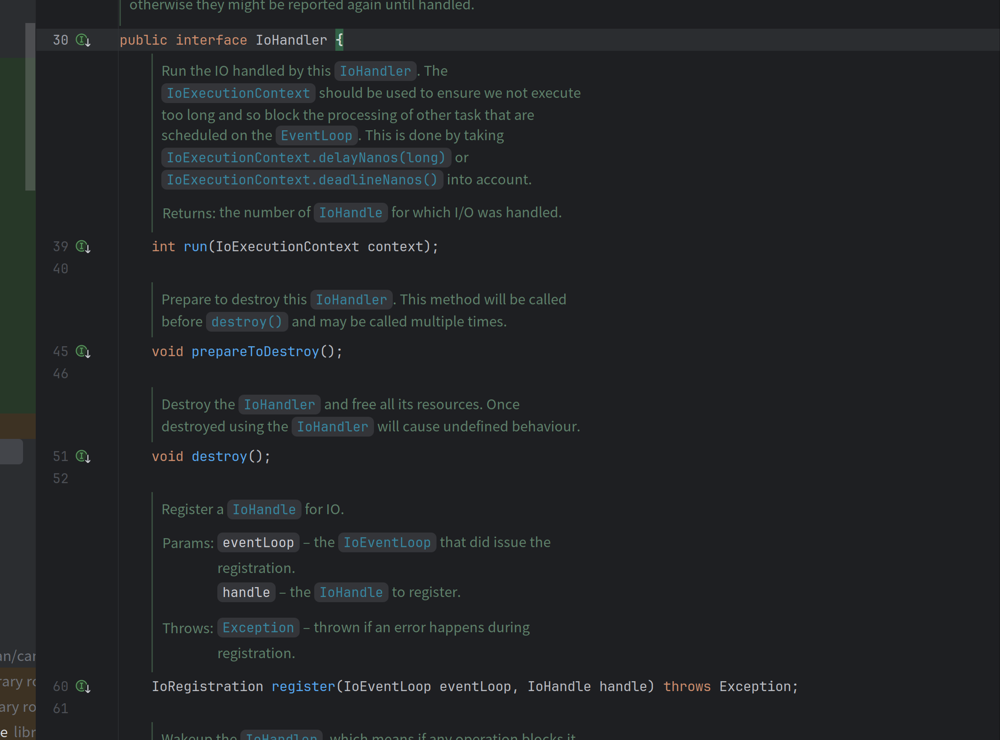
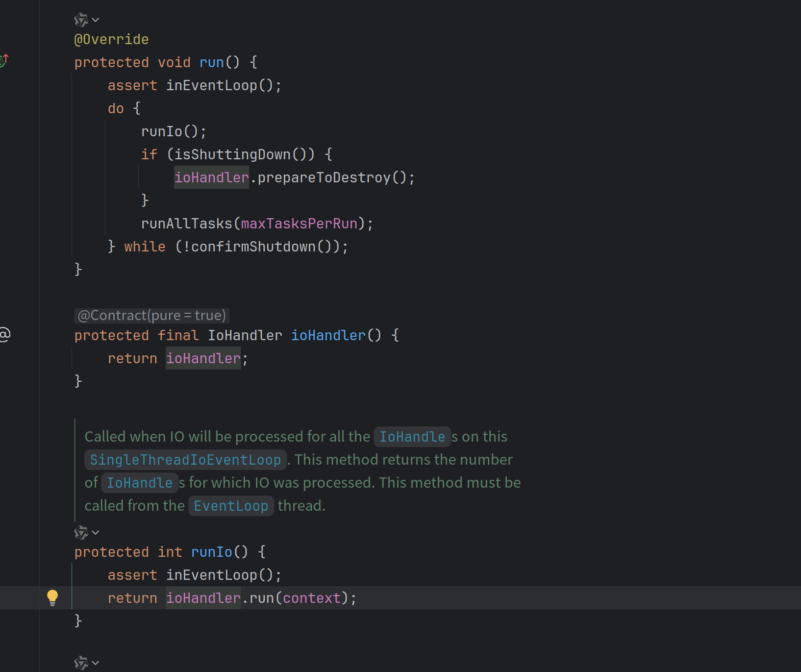
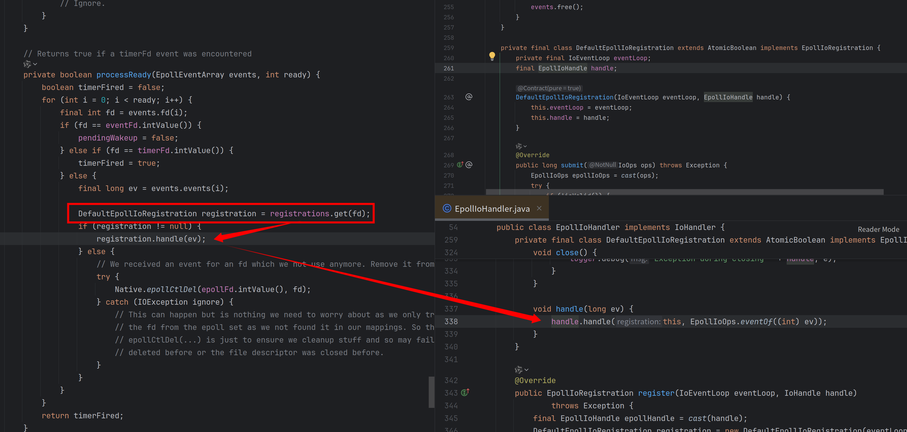
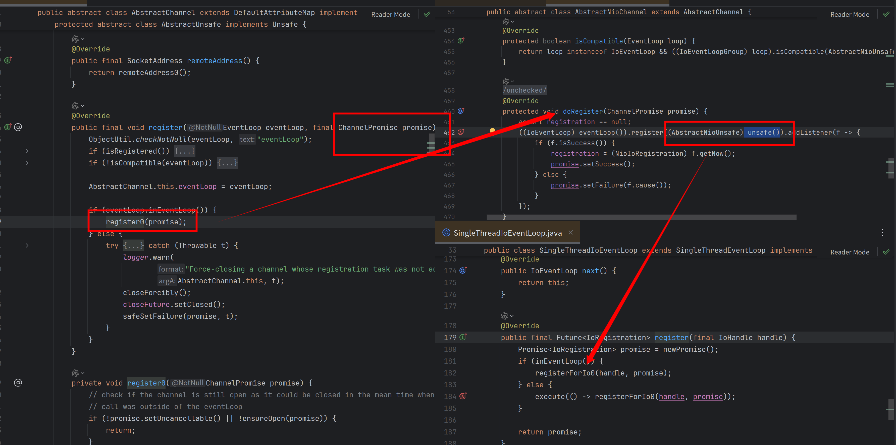
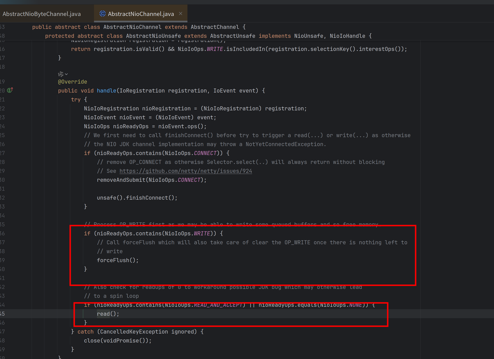
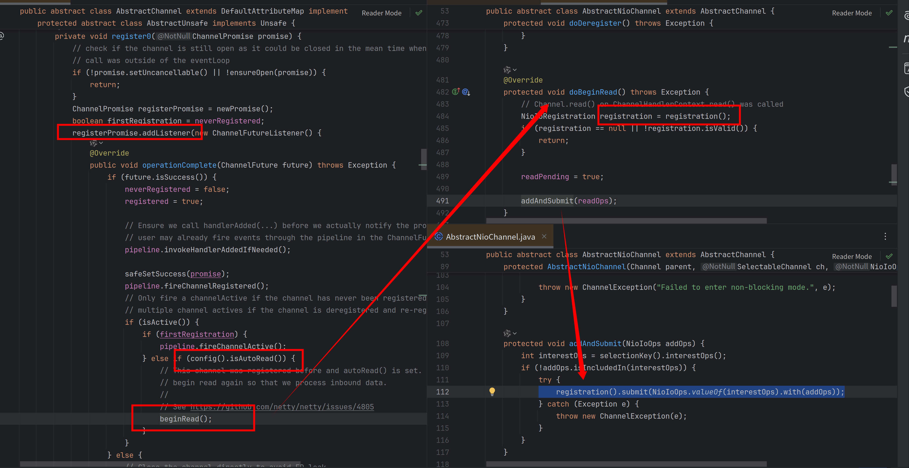

# Netty4.2模型变化简介

## 前言

Netty is *an asynchronous event-driven network application framework*
for rapid development of maintainable high performance protocol servers & clients.这是Netty对于自己的简介，那么很明显它是专注于网络库的，所以它的模型*EventLoop+Channel,似乎可以处理大部分的网络IO情况，如果需要切换Reactor核心则需要使用一个新的EventLoop子类，似乎看起来没什么问题？

如果你对于Linux上的各种fd足够熟悉的话，你会发现这一套似乎不能套在诸如pipefd,eventfd上，虽然其底层用了Epoll作为Reactor实现，但是却被Netty的模型限制住了扩展性

## 模型切换

### 4.1现状

当前使用EventLoop直接管理对应的channel，将EventLoop和Channel的关系非常紧密的绑在一起，如果需要切换EventLoop实现也需要同步切换Channel,似乎看起来没问题？


如果我们仔细看一下NIOEventLoop和EpollEventLoop的实现，会发现它们存在大量重复的代码，因为大多数EventLoop实现都共享运行非 IO 任务的相同逻辑。

而且由于netty io_uring的引入，对于一个File很难把这套Channel的抽象套上去（流和块的不同）

### 4.2更改

> 本节内容来自于
>
> https://github.com/netty/netty/pull/13991
>
> https://github.com/netty/netty/pull/14024

#### EventLoop更新

目前不再使用定制化的EvenLoop,而是将对应的IO逻辑抽离为IoHandler,交由具体的Reactor实现

旧 API：

```java
new EpollEventLoop()
```

新 API：

```java
new MultiThreadIoHandleEventLoopGroup(EpollHandler.newFactory();
```

这样就解决了不同EventLoop之间的非IO逻辑无法复用的问题

#### Channel和EventLoop解耦

我们首先开看下IoHandler的接口声明，核心是两个函数run和register

- run —— 抽象的IO Poll动作，EventLoop会调用这个函数进行原来的Selector::select,即请求Poller实现来进行多路复用
- register —— 用来给Poller注册感兴趣事件的回调，调用此方法只是将IoHandle(注意看这里是handle而非handler)与这个IoHandler关联起来，具体注册可读/可写事件是在返回的IoRegistration上实现的



那么最终EventLoop就可以不感知Channel这种结构了一切交给IoHandler进行实现（跟boost.asio的iocontext有点像）



而对于IoHandler感知的则是fd->IoHandle的映射，然后拿到IoHandle只是简单执行下IoHandle回调而已，旧有的Channel-Pipeline体系仍旧可以使用，只不过触发者从原来的EventLoop直接触发，变成了EventLoop->IoHandler->IoHandle->Channel而已，做了一个抽象层出来这样就不必跟Channel模型强耦合了



#### 旧有Channel-Pipeline机制适配

>  这里展示的实现是NioChannel这一套，即Netty使用的JDK的默认实现

在旧有的代码里面其实注册，读写Socket触发Pipeline都是Netty中的Unsafe类完成的，其与一个Channel进行了关联，那么在新模型下面让其实现一个IOHandle再合适不过



此时有感兴趣事件被poll到了就会通知到IoHandle（即Unsafe），其内部再进行分发，根据不同事件触发旧有的不同逻辑



那么就剩下最后一个问题了，IoHandle注册到IoHandler之后得到的IoRegistration在哪里使用的呢？

在我们注册之后的的异步回调里面 如果开启了自动读（默认开启）则会触发`BeginRead`此时就会注册对应的事件



## 模型利用

4.2模型更新之后其实我们需要实现对应的IoHandle即可，再也不用强行把某些东西套在Channel上了

以netty-transport-native-epoll为例子，我们来介绍如何将一个EventFd挂在到当前已经存在的EventLoop上

首先你肯定有这样一个EventLoopGroup

```java
MultiThreadIoEventLoopGroup masterGroup = new MultiThreadIoEventLoopGroup(1, EpollIoHandler.newFactory());

```

那么结合我们刚才分析的你这里需要一个IoHandle来注册到Iohandler，由于不同IoHandler的底层不一样所以需要不同IoHandle实现，这里我们需要实现的是EpollIoHandle，相比于IoHandle只是多了一个fd,传入一个Epoll能poll的fd就好了，这里我们是EventFd满足这个条件

```java
@Override
public FileDescriptor fd() {
    return eventFd;
}
@Override
public void handle(IoRegistration registration, IoEvent ioEvent) {
   //。。。。
}
```

那么我们再来仔细看下回调实现，在EpollIoHandler发现当前Fd有事件被触发来之后用当前被触发的事件进行回调

```java
 @Override
 public void handle(IoRegistration registration, IoEvent ioEvent) {
     EpollIoEvent epollIoEvent = (EpollIoEvent) ioEvent;
     System.out.println(epollIoEvent.ops());
     if (epollIoEvent.ops().contains(EpollIoOps.EPOLLIN)) {
         long readEvent = readEvent();
         System.out.println("read event: " + readEvent);
     }
 }
```

让我们仔细看一下IoEvent，会发现这个是一个标记性接口，所以需要根据当前的实现进行转为对应的Event从而获取到具体事件


详细源码可见：

<script src="https://gist.github.com/dreamlike-ocean/ae6031e198011a80ad8771d9d6fb6c96.js"></script>