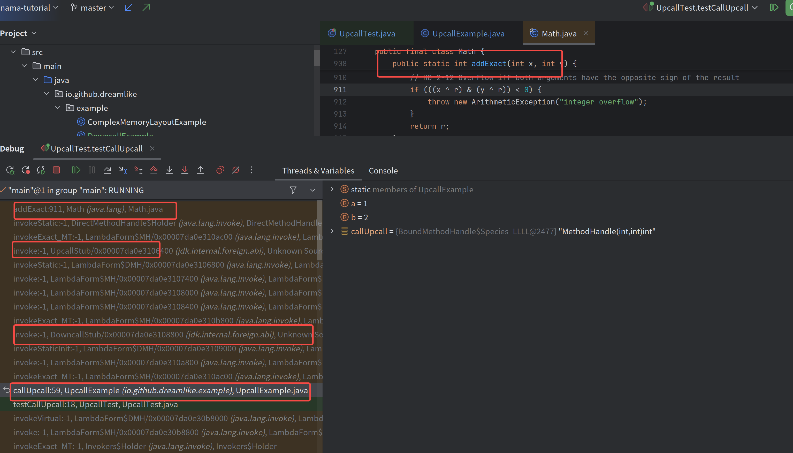
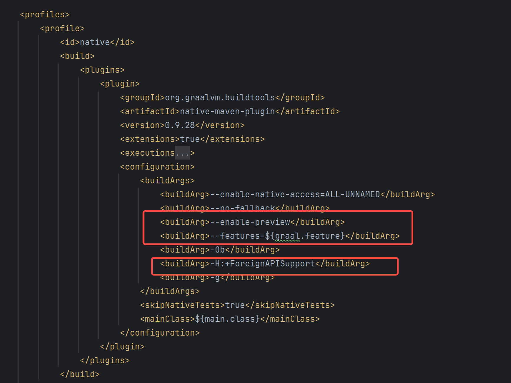

# Panama教程-3-FFI介绍

> 若无特别提及，这里提到的abi均为x86 64 systemv abi
>
> 示例代码可以从这里找到
>
> https://github.com/dreamlike-ocean/Panama-tutorial

## 前言

截至目前我们对于FFM和一些java.invoke.*基建已经介绍完毕，那么就到了重头戏——开始介绍Panama带来的新FFI API,使用纯Java API调用符合当前平台abi的函数

那么我先来介绍下什么叫做“符合当前平台abi”，它有以下含义

- 函数符号——即函数名稳定，例如我们声明一个函数叫做A,编译为动态库之后其符号也为A
- 传入参数和返回值的符合当前平台调用约定，举个例子当前平台调用约定是将第一个参数放在a寄存器上，那么对应动态库也是如此取值
- 结构体布局一致，直观表现就是与当前平台C语言编译出来的结构体布局一致，某些语言可能会进行结构体字段重排以降低结构体大小，那么就需要抑制这些重排

## 环境准备

由于C/C++工具链比较碎且不统一，所以本文使用的动态库是由Rust编译而来，涉及到的Rust代码会尽可能简单直观

为了方便对应涉及到FFI部分的内容均以Linux x86_64架构

### 构建工具链展示

Rust可以直接根据其[官网](https://www.rust-lang.org/learn/get-started)指示进行安装对应工具链

JDK使用任意发行版Java22即可,由于本文会涉及部分native-image操作所以比较推荐使用GraalVM23

```java
➜  Panama-tutorial git:(master) ✗ cargo --version 
cargo 1.81.0 (2dbb1af80 2024-08-20)
➜  Panama-tutorial git:(master) ✗ mvn -v      
Apache Maven 3.9.4 (dfbb324ad4a7c8fb0bf182e6d91b0ae20e3d2dd9)
Maven home: /home/dreamlike/.sdkman/candidates/maven/current
Java version: 23, vendor: Oracle Corporation, runtime: /home/dreamlike/jdks/graalvm-jdk-23_linux-x64_bin/graalvm-jdk-23+37.1
Default locale: zh_CN, platform encoding: UTF-8
OS name: "linux", version: "6.8.0-31-generic", arch: "amd64", family: "unix"

```

### 将Rust构建与Maven构建打通

#### exec插件

Maven的[exec插件](https://www.mojohaus.org/exec-maven-plugin/)，可以允许在某些Maven phase执行一些可执行文件，所以我们可以利用这个插件在compile phase的时候调用cargo来构建我们的Rust写的动态库代码

```java
 <plugin>
     <groupId>org.codehaus.mojo</groupId>
     <artifactId>exec-maven-plugin</artifactId>
     <version>1.6.0</version>
     <executions>
         <execution>
             <id>prepare-libPerson</id>
             <phase>compile</phase>
             <goals>
                 <goal>exec</goal>
             </goals>
             <configuration>
                 <executable>sh</executable>
                 <workingDirectory>${project.basedir}/src/main/rust</workingDirectory>
                 <arguments>
                     <argument>build.sh</argument>
                 </arguments>
             </configuration>
         </execution>
     </executions>
 </plugin>
```

#### 构建脚本

cargo其实还不能完全满足我们的需求，比如说只移动少数产物等，所以我这里写了一个简单的脚本来完成

```shell
rm -f ../../../libperson.so
cargo build
mv target/debug/libperson.so ../../../libperson.so
```

#### 项目布局

```

├── pom.xml
├── README.md
└── src
    ├── main
    │   ├── java
    │   │   └── io
    │   │       └── github
    │   │           └── dreamlike
    │   │               ├── example
    │   │               │   ├── ComplexMemoryLayoutExample.java
    │   │               │   ├── MemoryLayoutExample.java
    │   │               │   └── UpcallExample.java
    │   │               ├── LibLoader.java
    │   │               ├── Main.java
    │   │               ├── NativeLookup.java
    │   │               └── PanamaFeature.java
    │   ├── resources
    │   └── rust
    │       ├── build.sh
    │       ├── Cargo.lock
    │       ├── Cargo.toml
    │       ├── clean.sh
    │       ├── src
    │       │   └── lib.rs
    │       └── tests
    │           └── test.rs
    └── test
        └── java
            ├── ComplexMemoryLayoutTest.java
            ├── MemoryLayoutTest.java
            └── UpcallTest.java
```

## Java -> Native

对于大部分FFI需求都是从Java调用Native，这一步我们一般称之为downcall，先来个简单的例子来介绍下

首先是Rust部分no_mangle代表了让rustc不要改这个函数名称，以稳定函数符号

其次是 extern "C" 告诉rustc要使用当前平台的调用约定处理入参

最后我们直接进行mvn compile编译出来一个动态库即可

```rust
#[no_mangle]
pub extern "C" fn add(i: i32, j: i32) -> i32 {
    i + j
}
```

对于一个函数的调用大概分为这几步（有兴趣的可以看看这一篇源码解读[Panama实现解读](Panama浅析.md)）

1. 链接器寻找到函数地址
2. 转换入参到当前平台的调用约定
3. 跳转到对应的函数地址进行执行
4. 根据调用约定获取返回值返回

### 寻找函数符号地址

#### 自定义的动态库

首先还是跟以前JNI一样使用System下的load*函数进行加载即可

```java
 System.load(new File("libperson.so").getAbsolutePath());
```

通过SymbolLookup就可以从加载的动态库里面解析处理出来的对应的函数符号地址

```java
Optional<MemorySegment> fp = SymbolLookup.loaderLookup()
        .find("add")
```

#### 当前libc中函数地址

某些函数在libc中就存在，这里就不要用加载额外的动态库了

```java
Optional<MemorySegment> fp = Linker.nativeLinker().defaultLookup().find("getpagesize")
```

#### 将两者结合起来使用

```java
import java.lang.foreign.Linker;
import java.lang.foreign.MemorySegment;
import java.lang.foreign.SymbolLookup;
import java.util.Optional;

public class NativeLookup implements SymbolLookup {

    public static final NativeLookup INSTANCE = new NativeLookup();

    @Override
    public Optional<MemorySegment> find(String name) {
        return SymbolLookup.loaderLookup()
                .find(name)
                .or(() -> Linker.nativeLinker().defaultLookup().find(name));
    }
}
```

### 声明函数调用方式

#### 简单的调用

我们目前只找到了函数符号的地址，你可以类比为我们只为c语言中的函数指针赋值了，但是还没决定他的类型

那么接下来我们使用FunctionDescriptor.of来声明对应的类型

```java
    public static int add(int a, int b) {
        try {
            MemorySegment fp = NativeLookup.INSTANCE.find("add").get();
            //实际使用的时候务必要const化
            MethodHandle addMH = Linker.nativeLinker().downcallHandle(
                    fp,
                //这里声明了对应的参数列表
                    FunctionDescriptor.of(ValueLayout.JAVA_INT,ValueLayout.JAVA_INT, ValueLayout.JAVA_INT)
            );
            return (int) addMH.invokeExact(a, b);
        } catch (Throwable e) {
            throw new RuntimeException(e);
        }
    }
```

#### 进阶调用方法

对于add函数这种简单的函数似乎我们的ffi调用速度不够快，那么能不能再快一些

这个时候我们就需要在后面加入Option了，` Linker.Option.critical`可以允许我们跳过一些校验和状态转换，甚至跳过安全点轮询

大大加快了调用速度，但是请注意由于跳过了很多校验和安全措施，所以若对应的函数执行时间过长会导致产生巨大的性能劣化，比如说GC安全点等待时间过长

```java
    public static int addFast(int a, int b) {
        try {
            MemorySegment fp = NativeLookup.INSTANCE.find("add").get();
            //实际使用的时候务必要const化
            MethodHandle addMH = Linker.nativeLinker().downcallHandle(
                    fp,
                    FunctionDescriptor.of(ValueLayout.JAVA_INT,ValueLayout.JAVA_INT, ValueLayout.JAVA_INT),
                    Linker.Option.critical(false)
            );
            return (int) addMH.invokeExact(a, b);
        } catch (Throwable e) {
            throw new RuntimeException(e);
        }
    }
```

做了个粗糙的benchmark 可以看出来critical还是有效果的

```java
public static void rawBenchmark() {
    //add rawBenchmark: 5
    //addFast rawBenchmark: 3
    long start = System.currentTimeMillis();
    long count = 10_0000;
    for (int i = 0; i < count; i++) {
        add(1, 2);
    }
    System.out.println("add rawBenchmark: " + (System.currentTimeMillis() - start));
    start = System.currentTimeMillis();
    for (int i = 0; i < count; i++) {
        addFast(1, 2);
    }
    System.out.println("addFast rawBenchmark: " + (System.currentTimeMillis() - start));
}
```

#### 传递Java Heap Array到Native

某些情况下我们需要将Java的一个数组传递到Native，此时我们就需要使用`Linker.Option.critical(true)`了

对于这样的一个native函数

```rust
#[no_mangle]
pub unsafe  extern "C" fn get_array_by_index(java_heap_array: *mut i64, index: i32) -> i64{
    java_heap_array.add(index as usize).read()
}
```

我们只需要这样声明即可，注意由于传入了 Linker.Option.critical 务必牢记刚才提到的对JVM性能的影响

这个传入的原理原理是，由于此时并不处于安全点所以Java对象的位置是稳定的（没有被gc移动）然后通过对象地址和数组头大小获取到真实的数组开始地址，即传递的地址实际为 &array + long_array_offset

```java
 getArrayByIndexMH = Linker.nativeLinker().downcallHandle(
         NativeLookup.INSTANCE.find("get_array_by_index").get(),
         FunctionDescriptor.of(ValueLayout.JAVA_LONG, ValueLayout.ADDRESS, ValueLayout.JAVA_INT),
         Linker.Option.critical(true)
 );


public static long getByIndex(long[] array, int index) {
    try {
        return (long) getArrayByIndexMH.invokeExact(MemorySegment.ofArray(array), index);
    } catch (Throwable e) {
        throw new RuntimeException(e);
    }
}

```

### 函数调用特殊例子

#### 过大的返回值类型

x86_64 SystemV的abi为例子，若返回值是个结构体且其大小大于两个八字节或包含未对齐的字段那么就需要一些特殊的方案了

> 如果返回值的类是 MEMORY，则调用者为返回提供空间并把指向这块空间的指针值放在`%rdi`中传递，即作为第一个隐藏的参数，返回时 `%rax` 的值为在 `%rdi` 中传入的指针值

以这个为例子

```rust
#[repr(C)]
pub struct big_struct {
    pub a: i64,
    pub b: i64,
    pub c: i64,
    pub d: i64,
}
#[no_mangle]
pub extern "C" fn new_big_struct() -> big_struct {
    big_struct {
        a: 1,
        b: 2,
        c: 3,
        d: 4,
    }
}
```

那么我可以很快地写出来对应的绑定

```java
public static final StructLayout BigStructLayout = MemoryLayout.structLayout(
        ValueLayout.JAVA_LONG.withName("a"),
        ValueLayout.JAVA_LONG.withName("b"),
        ValueLayout.JAVA_LONG.withName("c"),
        ValueLayout.JAVA_LONG.withName("d")
);
var newBigStructMH = Linker.nativeLinker().downcallHandle(
        NativeLookup.INSTANCE.find("new_big_struct").get(),
        FunctionDescriptor.of(BigStructLayout)
);
// X这里是跑不通的
 public static MemorySegment newBigStruct() {
     try {
         return (MemorySegment) newBigStructMH.invokeExact();
     } catch (Throwable e) {
         throw new RuntimeException(e);
     }
 }
```

真正跑起来之后会发现抛出了一个异常，所以这里需要按照传入一个分配器

```java
java.lang.RuntimeException: java.lang.invoke.WrongMethodTypeException: handle's method type (SegmentAllocator)MemorySegment but found ()MemorySegment

	at io.github.dreamlike.example.DowncallExample.newBigStruct(DowncallExample.java:100)
	at DowncallTest.testBigStruct(DowncallTest.java:25)
	... more
Caused by: java.lang.invoke.WrongMethodTypeException: handle's method type (SegmentAllocator)MemorySegment but found ()MemorySegment
	at java.base/java.lang.invoke.Invokers.newWrongMethodTypeException(Invokers.java:521)
	at java.base/java.lang.invoke.Invokers.checkExactType(Invokers.java:530)
	at io.github.dreamlike.example.DowncallExample.newBigStruct(DowncallExample.java:98)
	... 26 more
```

所以我们需要这样一改

```java
 public static MemorySegment newBigStruct(SegmentAllocator segmentAllocator) {
     try {
         return (MemorySegment) newBigStructMH.invokeExact(segmentAllocator);
     } catch (Throwable e) {
         throw new RuntimeException(e);
     }
 }
```

我们可以稍微从堆栈看一眼发生了什么，在真实调用之前先调用传入的分配器分配出来一段内存，然后才按照abi进行调用


#### errorno

某些syscall在出错的时候返回一个-1然后设置errorno,那么我们在新的ffi中如何获取这个errorno呢？

首先让我们模拟一个errorno

```rust
#[no_mangle]
pub unsafe extern "C" fn error_syscall(errono: usize) -> i32 {
    libc::__errno_location().write(-(errono as i32));
     -1
}
```

那么对应的绑定是

需要通过特殊的Linker option和一个特殊的前导参数完成

```java
 errorSyscallMH = Linker.nativeLinker().downcallHandle(
         NativeLookup.INSTANCE.find("error_syscall").get(),
         FunctionDescriptor.of(ValueLayout.JAVA_INT, ValueLayout.JAVA_INT),
         Linker.Option.captureCallState("errno")
 );

public static int errorSyscall(int errorno) {
    try (Arena arena = Arena.ofConfined()) {
        StructLayout capturedStateLayout = Linker.Option.captureStateLayout();
        VarHandle errnoHandle = capturedStateLayout.varHandle(MemoryLayout.PathElement.groupElement("errno"));
        MemorySegment capturedState = arena.allocate(capturedStateLayout);
        var _ = (int) errorSyscallMH.invokeExact(capturedState, errorno);
        return (int) errnoHandle.get(capturedState, 0L);
    } catch (Throwable e) {
        throw new RuntimeException(e);
    }
}
```

#### 以上两种结合起来

```java
 public static MemorySegment newBigStructErrorNo(SegmentAllocator segmentAllocator) {
     try (Arena arena = Arena.ofConfined()) {
         StructLayout capturedStateLayout = Linker.Option.captureStateLayout();
         VarHandle errnoHandle = capturedStateLayout.varHandle(MemoryLayout.PathElement.groupElement("errno"));
         MemorySegment capturedState = arena.allocate(capturedStateLayout);
         //先放分配器 再放capturedState
         return  (MemorySegment) newBigStructErrorNoMH.invokeExact(segmentAllocator, capturedState);
     } catch (Throwable e) {
         throw new RuntimeException(e);
     }
 }
```

## Native -> Java

有些时候可能需要从Native反过来调用Java的函数，比如说qsort就需要你传入一个比较函数，这个过程称之为upcall

### 简单upcall

我这里有个简单的涉及到upcall的函数，很简单就是将i+j+回调函数的结果 然后返回

```rust
#[no_mangle]
pub extern "C" fn callback(i: i32, j: i32, f: extern fn(i32, i32) -> i32) -> i32 {
    i + j + f(i, j)
}
```

那么downcall的部分先省略，我们来看看如何将一个Java函数作为函数指针传入

```java
MemorySegment upcallStub = Linker.nativeLinker().upcallStub(
        MethodHandles.lookup().findStatic(Math.class, "addExact", MethodType.methodType(int.class, int.class, int.class)),
        FunctionDescriptor.of(ValueLayout.JAVA_INT, ValueLayout.JAVA_INT, ValueLayout.JAVA_INT),
        Arena.global()
);
```

我们一个一个参数讲

第一个参数类型是Methodhanle,即我们之前提到的Java的函数指针，第二个则是要传递给Native的函数指针类型，最后一个则是这个upcallStub对应的内存空间什么时候允许释放

它做的事情很简单，使用最后一个参数分配空间，然后原地生成一段机器码存放起来，返回这个块空间的首地址作为函数指针的值

至于这段机器码只是做了当前abi到java abi的调用转换，然后找到对应java函数（methodstub）进行调用

那么最后我们只需要这样调用就好了

```java
 public static int callBackNative(int a, int b) {
     try {
         return (int) callbackMH.invokeExact(a, b, upcallStub);
     } catch (Throwable t) {
         throw new RuntimeException(t);
     }
 }
```

### downcall对接

upcall产生的函数指针是完全符合当前平台abi的，所以你甚至可以使用downcall api来调用你生成的这个upcall stub

```java
public static int z(int a, int b) {
    MethodHandle callUpcall = Linker.nativeLinker()
            .downcallHandle(
        //这里就是你upcall获得的指针
                    upcallStub,
                    FunctionDescriptor.of(ValueLayout.JAVA_INT, ValueLayout.JAVA_INT, ValueLayout.JAVA_INT)
            );
    try {
        return (int) callUpcall.invokeExact(a, b);
    } catch (Throwable t) {
        throw new RuntimeException(t);
    }
}
```

你可以在被call的Java函数里面打个断点看到清晰的堆栈



### 使用带捕获的Lambda作为upcall

在很多语言里面，不带有捕获的lambda是可以转换为函数指针使用的，但是对于Java来说带捕获的仍旧可以转换为函数指针

只需要一点点Methodhandle的小技巧即可，从这里也能看出来upcall不在乎methodhandle是什么，只要方法签名对的上就好

```java
public static int capturedLambdaUpcall(String someString) {
    interface Add {
        int add(int a, int b);
    }
    try {
        MethodHandle methodHandle = MethodHandles.lookup().findVirtual(Add.class, "add", MethodType.methodType(int.class, int.class, int.class));
        //bindTo相当于把第一个参数Add给了默认值
        methodHandle = methodHandle.bindTo((Add) (a, b) -> {
            System.out.println(someString);
            return someString.length();
        });
        var capturedLambdaUpcallStub = Linker.nativeLinker().upcallStub(
                methodHandle,
                FunctionDescriptor.of(ValueLayout.JAVA_INT, ValueLayout.JAVA_INT, ValueLayout.JAVA_INT),
                Arena.global()
        );
        return (int) Linker.nativeLinker()
                .downcallHandle(
                        capturedLambdaUpcallStub,
                        FunctionDescriptor.of(ValueLayout.JAVA_INT, ValueLayout.JAVA_INT, ValueLayout.JAVA_INT)
                ).invokeExact(1, 2);
    } catch (Throwable r) {
        throw new RuntimeException(r);
    }
}
```

## Native-image

这里使用Graal23进行示范，具体不同平台native-image兼容性可以参考[文档](https://www.graalvm.org/latest/reference-manual/native-image/native-code-interoperability/foreign-interface/)

为了快速看到结果，所以我这边选择了几乎无优化



注意红框的参数非常重要，然后我们需要在graal的feature中原封不动注册对应的downcall和upcall的方法签名和option

我们以刚才的例子对其native-image


对应的feature为

```java

import org.graalvm.nativeimage.hosted.Feature;
import org.graalvm.nativeimage.hosted.RuntimeForeignAccess;

import java.lang.foreign.FunctionDescriptor;
import java.lang.foreign.Linker;
import java.lang.foreign.ValueLayout;

public class PanamaFeature implements Feature {
    @Override
    public void duringSetup(DuringSetupAccess access) {
        RuntimeForeignAccess.registerForDowncall(
                FunctionDescriptor.of(ValueLayout.JAVA_LONG, ValueLayout.ADDRESS, ValueLayout.JAVA_INT),
                Linker.Option.critical(true)
        );

        RuntimeForeignAccess.registerForDowncall(
                FunctionDescriptor.of(ValueLayout.JAVA_INT, ValueLayout.JAVA_INT, ValueLayout.JAVA_INT)
        );

        RuntimeForeignAccess.registerForUpcall(
                FunctionDescriptor.of(ValueLayout.JAVA_INT, ValueLayout.JAVA_INT, ValueLayout.JAVA_INT)
        );
    }
}

```