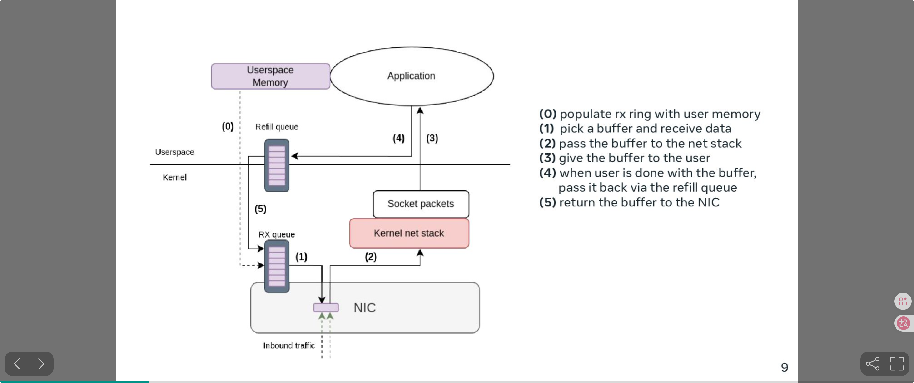
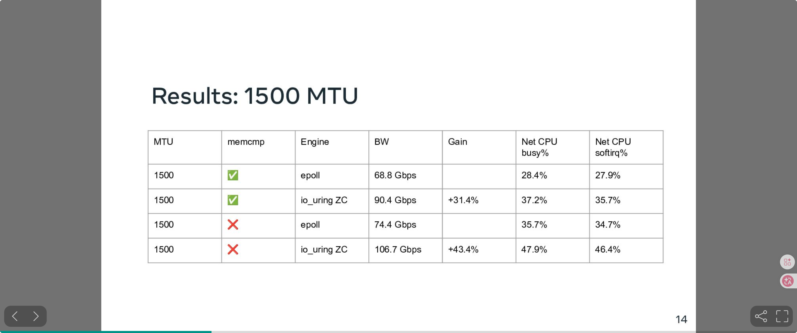

# API 网关性能翻倍技术实践（2025-2026）

> 本文梳理了过去一年多来我们在自研 API 网关上所做的一系列性能优化工作。这些改动覆盖了网络传输层、协议层、线程模型、内存管理等多个维度，最终实现了同等硬件条件下吞吐量翻倍的效果。

> English version: [API Gateway Performance Doubling in Practice (2025–2026)](api-gateway-performance-doubling.en.md)

此外，我们也将运行时从 JDK 17 升级到 JDK 25，获得了分代 ZGC、压缩对象头（Compact Object Headers）以及更好的 JIT 优化。

---

## 目录

- [一、整体架构概述](#一整体架构概述)
- [二、协议嗅探：去除 SSL/ALPN 依赖，自动识别 H1/H2](#二协议嗅探去除-sslalpn-依赖自动识别-h1h2)
- [三、连接池异步化：基于 CompletableFuture 的无锁等待](#三连接池异步化基于-completablefuture-的无锁等待)
- [四、Filter 虚拟线程化：释放 IO 线程](#四filter-虚拟线程化释放-io-线程)
- [五、io_uring 支持与调优 + Linux 6.1 内核升级](#五io_uring-支持与调优--linux-61-内核升级)
- [六、H2 关闭哈夫曼编码：以空间换时间](#六h2-关闭哈夫曼编码以空间换时间)
- [七、H2 Header 复用：消除 H2→H1→H2 转换开销](#七h2-header-复用消除-h2h1h2-转换开销)
- [八、移除 Header 对象池：分代 ZGC 下的跨代引用陷阱](#八移除-header-对象池分代-zgc-下的跨代引用陷阱)
- [九、APM Agent 内存分配优化](#九apm-agent-内存分配优化)
- [十、回馈上游：向 Netty 社区贡献优化](#十回馈上游向-netty-社区贡献优化)
- [十一、正在探索](#十一正在探索)
- [十二、总结与收益](#十二总结与收益)

---

## 一、整体架构概述

我们的网关是一个基于 Netty 的自研反向代理服务。在生产环境中，网关前方有云厂商提供的负载均衡器（LB），Client 的流量先经过 LB 再转发到网关；网关与后端 Upstream 之间全部使用 HTTP/2 通信。整体拓扑如下：

```
Client ──(H1/H2)──▶ Cloud LB ──(H1/H2 透传)──▶ Gateway (Netty Pipeline) ──(H2)──▶ Upstream Service
                                                       │
                                                  Filter Chain
                                                (认证/鉴权/限流/...)
```

一个关键背景是：云厂商的 LB 是**协议透明转发**的——Client 用 H1 发起请求，LB 就用 H1 转给网关；Client 用 H2 发起请求，LB 就用 H2 转给网关。网关必须在同一端口上同时处理 H1 和 H2 流量。

在优化之前，网关的主要性能瓶颈集中在以下几个方面：
1. **协议协商依赖 TLS/ALPN**，消耗约 10% 的 CPU 时间
2. **连接池阻塞等待**，IO 线程在获取后端连接时被阻塞
3. **Filter 在业务线程池上同步执行**，线程数有限，高并发下容易耗尽
4. **epoll 系统调用开销**，高并发下 syscall 频率成为瓶颈
5. **H2 编解码 CPU 消耗**，哈夫曼编解码及 header 转换消耗大量 CPU
6. **内存分配与 GC 压力**，频繁的对象创建和装箱操作增加 GC 负担

---

## 二、协议嗅探：去除 SSL/ALPN 依赖，自动识别 H1/H2

### 问题背景

由于云厂商 LB 的透明转发特性，网关必须在**同一端口**上分辨当前连接是 H1 还是 H2。最简单的办法是启用 TLS + ALPN 协商——但 TLS 握手和加解密在内网场景下纯粹是浪费，火焰图显示 ALPN 相关逻辑**吃掉了约 10% 的 CPU 时间**。

### 解决方案

灵感来源于 Vert.x 的 [Http1xOrH2CHandler](https://github.com/eclipse-vertx/vert.x/blob/436dfdfc0a596cd5aa20364d94d79f54938d25a6/vertx-core/src/main/java/io/vertx/core/http/impl/tcp/Http1xOrH2CHandler.java#L25)，我们实现了一个基于字节嗅探的协议自动检测 Handler。

HTTP/2 规范要求客户端在连接建立后首先发送一个 24 字节的连接前言（Connection Preface）：`PRI * HTTP/2.0\r\n\r\nSM\r\n\r\n`，而 HTTP/1.x 的请求行以方法名开头（`GET`、`POST` 等），二者不会冲突。利用这一点，我们在连接建立后读取首包字节进行匹配，根据结果动态配置 H1 或 H2 的 pipeline，随后 Handler 自我移除——后续数据流完全零开销：

```java
public class HttpProtocolSniffChannelHandler extends ChannelInboundHandlerAdapter {

    private static final ByteBuf H2_PREFACE = Http2CodecUtil.connectionPrefaceBuf();

    @Override
    public void channelRead(ChannelHandlerContext ctx, Object msg) {
        ByteBuf buf = (ByteBuf) msg;
        if (isHttp2Preface(buf)) {
            configurePipeline(ctx, Protocol.H2);
        } else {
            configurePipeline(ctx, Protocol.H1);
        }
        ctx.pipeline().remove(this);   // 协议确定后自我移除，后续零开销
        ctx.fireChannelRead(buf);
    }
}
```

这一改动彻底移除了 TLS/ALPN 的依赖，单端口同时支持 H1 和 H2 明文流量，**释放了约 10% 的 CPU**。

---

## 三、连接池异步化：基于 CompletableFuture 的无锁等待

### 问题背景

网关与后端服务之间维护连接池进行连接复用。原有实现在获取连接时使用同步阻塞等待（`SynchronousQueue`），当连接池耗尽时 IO 线程会被阻塞，直接拖慢事件循环的处理能力。

### 解决方案

我们参考 [HikariCP](https://github.com/brettwooldridge/HikariCP) 的 `ConcurrentBag` 设计，实现了完全异步非阻塞的连接池。其中最核心的改造是**将阻塞的 `SynchronousQueue` 替换为基于 `CompletableFuture` 的异步交换器**。

**原始 HikariCP 中的阻塞等待（SynchronousQueue）：**

```java
// HikariCP 原始实现：当连接池为空时，调用线程在此阻塞等待
T borrow(long timeout, TimeUnit unit) {
    // ... ThreadLocal 和 sharedList 都没命中 ...
    
    // 阻塞！线程在此挂起直到有连接归还
    T entry = handoffQueue.poll(timeout, unit);  // SynchronousQueue.poll()
    return entry;
}
```

**我们的异步实现（AsyncQueue）：**

```java
/**
 * 基于 CompletableFuture 的异步交换器，替代 SynchronousQueue
 * 核心思想：用 Future 注册代替线程挂起
 */
class AsyncQueue<T> {
    private final ConcurrentLinkedQueue<CompletableFuture<T>> waiters = new ConcurrentLinkedQueue<>();

    /**
     * 连接归还时调用：尝试将连接直接交付给第一个等待者
     */
    boolean offer(T item) {
        CompletableFuture<T> waiter;
        while ((waiter = waiters.poll()) != null) {
            if (waiter.complete(item)) return true;  // CAS 完成，交付成功
            // complete 失败说明 waiter 已超时取消，继续尝试下一个
        }
        return false;  // 没有等待者
    }

    /**
     * 获取连接时调用：注册一个 Future 等待交付，线程不阻塞
     */
    CompletableFuture<T> poll(long timeout, TimeUnit unit) {
        CompletableFuture<T> future = new CompletableFuture<>();
        waiters.offer(future);
        // 使用 HashedWheelTimer 做超时，而非 CompletableFuture.orTimeout()
        // 后者内部使用 ScheduledThreadPoolExecutor，高并发下线程竞争严重
        timer.newTimeout(t -> future.completeExceptionally(TIMEOUT_EXCEPTION), timeout, unit);
        return future;
    }
}
```

**为什么不用 `CompletableFuture.orTimeout()`？**

`orTimeout()` 内部使用 `ScheduledThreadPoolExecutor` 的 `delayedExecute`，在高并发场景下需要获取锁来操作延迟队列，产生不必要的竞争。而 Netty 的 `HashedWheelTimer` 是单线程驱动的时间轮，超时注册是 O(1) 的无锁操作，更适合大量短生命周期定时任务。

**整体获取流程：**

```
borrowAsync() 执行流程：

  ① ThreadLocal List（最快路径，CAS 操作）
     │  命中 → CompletableFuture.completedFuture(entry)
     │  未命中 ↓
  ② Shared CopyOnWriteArrayList（快速路径，CAS 扫描）
     │  命中 → CompletableFuture.completedFuture(entry)
     │  未命中 ↓
  ③ AsyncQueue.poll()（注册 Future，立即返回，不阻塞）
     │  有连接归还 → future.complete(entry)
     │  超时 → future.completeExceptionally(timeout)
```

### 收益

- IO 线程不再因等待连接而阻塞，事件循环吞吐显著提升
- 完全异步的 `CompletableFuture` 接口，与 Netty 事件模型完美契合
- `HashedWheelTimer` 替代 `ScheduledExecutorService` 做超时，减少高并发下的线程竞争

---

## 四、Filter 虚拟线程化：释放 IO 线程

### 问题背景

网关的 Filter Chain 中包含认证、鉴权、限流等多个 Filter，部分 Filter 涉及 Redis 查询、数据库访问等阻塞 I/O 操作。在原有模型中，Filter 切换到额外的业务线程池（`DefaultEventExecutorGroup`）执行，但平台线程数有限，高并发下容易耗尽。

### 解决方案：Virtual Thread

我们利用 JDK 21 的虚拟线程（Project Loom）来执行 Filter Chain，替换原来的 `DefaultEventExecutorGroup`：

```
优化前：
  IO Thread ──dispatch──▶ DefaultEventExecutorGroup (固定 N 个平台线程)
                          ├── Filter1(sync)
                          ├── Filter2(Redis阻塞) ← 线程被占满时新请求排队
                          └── Filter3(sync)

优化后：
  IO Thread ──dispatch──▶ VirtualThread Executor (每请求一个虚拟线程)
                          ├── Filter1(sync)
                          ├── Filter2(Redis阻塞) ← 虚拟线程自动 yield，不占平台线程
                          └── Filter3(sync)
```

### 配套适配：ThreadLocal 在虚拟线程上的性能问题

虚拟线程引入后我们遇到了一个非直觉的问题：**`ThreadLocal` 在虚拟线程上表现不佳**。

原因在于虚拟线程的生命周期极短（通常一个请求结束就销毁），`ThreadLocal` 的缓存语义完全失效——每次都是初始化、使用、丢弃，无法享受"缓存复用"的好处，反而引入了额外的 `ThreadLocalMap` 初始化和 Entry 分配开销。

这不是我们独有的问题。Jackson 社区也遇到了同样的情况：[jackson-core#919](https://github.com/FasterXML/jackson-core/issues/919) 中记录了 Jackson 内部的 `ThreadLocal<SoftReference<BufferRecycler>>` 在虚拟线程场景下导致严重的性能退化——每个虚拟线程都新建 BufferRecycler，而 `SoftReference` 又增加了 GC 压力。

我们的应对方式是将 Netty `Recycler` 中虚拟线程场景下的 per-thread 对象池替换为全局共享的有界 MPMC 队列，让虚拟线程也能高效复用对象。

### 收益

- IO 线程完全解放，专注网络读写
- 虚拟线程数量无上限，不存在线程池饱和问题
- Filter 中的阻塞调用（Redis/DB）自动 yield，不浪费 CPU

> ⚠️ **JDK 版本建议**：在 JDK 21 中，虚拟线程进入 `synchronized`（Object Monitor）时会 **pin 住 carrier thread**，从而失去阻塞点自动 unmount/yield 的伸缩性优势；如果 monitor 使用较多，可能触发补偿线程（compensation）增多，带来线程数膨胀与调度开销。
>
> 建议优先使用较新的 JDK（并持续跟进 Loom 相关修复/优化），并尽量减少虚拟线程上的长时间 monitor 持有。
>
> 此外，虚拟线程在 classloader 场景下还存在死锁风险（[案例一](https://mail.openjdk.org/pipermail/loom-dev/2025-November/007998.html)、[案例二](https://mail.openjdk.org/pipermail/loom-dev/2025-December/008097.html)）——当虚拟线程触发类加载时，可能与其他线程在 classloader 锁上产生死锁，导致整个应用 hang 住。[JDK-8347265](https://github.com/openjdk/jdk/pull/27802) 能缓解此问题，建议关注并及时升级。
>
> **实践建议**：只允许受控的、行为可预测的代码运行在虚拟线程上，并且尽可能确保虚拟线程运行期间不会触发类加载（即所有相关类在应用启动阶段就已加载完毕）。

---

## 五、io_uring 支持与调优 + Linux 6.1 内核升级

### 问题背景

传统的 epoll 模型在高并发场景下存在以下问题：
- 每次 IO 操作需要独立的系统调用（`epoll_wait` + `read`/`write`）
- 用户态与内核态频繁切换，上下文切换开销大
- 数据拷贝：`write` 系统调用需要将数据从用户态拷贝到内核态

### 解决方案：io_uring + Linux 6.1

我们升级 Netty 到 4.2 系列，引入 io_uring 传输层，并将 Linux 内核升级到 6.1 以获取完整的 io_uring 特性支持。

### 5.1 Multishot：一次提交，持续收割

Multishot 是 io_uring 最具影响力的特性之一。传统模型下，每次 `recv`/`accept` 都需要提交一个 SQE 到 submission queue，内核处理完成后返回一个 CQE，然后用户态再提交下一个 SQE——这意味着每次 IO 操作都有一次 SQE 提交开销。

Multishot 打破了这个 1:1 的循环：

```
传统模式（one-shot）：
  用户态 → 提交 recv SQE → 内核完成 → 返回 CQE → 用户态 → 提交 recv SQE → ...
  每收一个包，都要重新提交一次 SQE

Multishot 模式：
  用户态 → 提交 recv_multishot SQE → 内核完成 → 返回 CQE₁
                                    → 内核完成 → 返回 CQE₂   ← 无需用户态重新提交！
                                    → 内核完成 → 返回 CQE₃
                                    → ...
  一次提交，内核持续返回数据，直到连接关闭或显式取消
```

在我们的网关场景下，三种 multishot 特性全部启用：

| 特性 | 最低内核版本 | 作用 |
|------|-------------|------|
| `poll_multishot` | Linux 5.13+ | 一次注册即可持续监听 fd 可读/可写事件 |
| `accept_multishot` | Linux 5.19+ | 一次提交即可持续 accept 新连接 |
| `recv_multishot` | Linux 6.0+ | 一次提交即可持续接收数据 |

由于 multishot 模式下，一个 SQE 会产生多个 CQE（完成事件比提交事件更多），我们需要相应地增大 CQE 队列：

```java
IoUringIoHandlerConfig config = new IoUringIoHandlerConfig();
config.setRingSize(4096);  // SQE 队列

// multishot 会产生更多 CQE，需要加大 CQE 队列防止溢出
if (IoUring.isAcceptMultishotEnabled() || IoUring.isRecvMultishotEnabled() 
    || IoUring.isPollAddMultishotEnabled()) {
    config.setCqSize(config.getRingSize() * 4);  // CQE = SQE × 4
}
```

### 5.2 Buffer Ring：配合 recv_multishot 的内存利器

传统 `recv` 调用需要用户态预先分配好 buffer 并在 SQE 中指定。这意味着**每个连接必须预分配一个接收 buffer**——对于十万连接级别的网关，这是巨大的内存浪费（大部分连接在大部分时间是空闲的）。

Buffer Ring 是 io_uring 提供的内核侧 buffer 池化机制，它完美解决了这个问题。

需要强调的是：**Buffer Ring 并不意味着 `recv` 零拷贝**，它只是让内核自动选择一个已注册的 buffer，然后把内核协议栈中的数据拷贝进这个 buffer，最后通过 CQE 把 buffer id/长度返回给用户态。

```
传统模式（per-connection buffer）：
  连接1 → buffer1 (4KB, 空闲中...)
  连接2 → buffer2 (4KB, 空闲中...)
  连接3 → buffer3 (4KB, 空闲中...)
  ...
  连接N → bufferN (4KB, 空闲中...)
  总内存 = N × 4KB，大部分时间浪费

Buffer Ring 模式：
  内核共享 buffer pool ←── 所有连接按需从池中获取
  连接1 recv → 从池中取 buffer → 填充数据 → 返回用户态 → 用户态处理后归还
  总内存 = pool_size × buffer_size，远小于 N × buffer_size
```

这也是 `recv_multishot` 的前置依赖——因为 multishot 模式下内核会自主发起多次 recv，如果每次都需要用户态指定 buffer，那就不叫 multishot 了。Buffer Ring 让内核自己从池中选 buffer，真正实现了"提交一次，持续接收"。

```java
if (IoUring.isRegisterBufferRingSupported()) {
    IoUringBufferRingConfig bufferRingConfig = IoUringBufferRingConfig.builder()
        .allocator(new IoUringAdaptiveBufferRingAllocator(
            ByteBufAllocator.DEFAULT, 
            1024,    // 最小 buffer
            1024,    // 初始 buffer
            4096,    // 最大 buffer（自适应增长）
            true))
        .bufferRingSize((short) 4096)  // ring 中的 buffer 槽位数
        .batchAllocation(true)
        .batchSize(2048)               // 批量分配 2048 个 buffer
        .build();
    config.setBufferRingConfig(bufferRingConfig);
}
```

**`batchAllocation` 与 TLB 失效**：流量突增时若逐个分配 buffer，每次分配可能映射新的物理页，导致 TLB（Translation Lookaside Buffer）抖动。批量分配 2048 个 buffer 利用内存空间局部性，显著减少 TLB miss。

### 5.3 Zero-Copy Send

对于超过阈值（默认 32KB）的写入操作，使用 `IORING_OP_SEND_ZC`（Linux 6.0+, 稳定于 6.1）实现内核零拷贝发送：

```
普通 write：  用户态 buffer → 拷贝到内核态 buffer → 网卡发送
Zero-copy：  用户态 buffer ────── DMA 直接发送 ──→ 网卡
                                 ↑ 无拷贝！
```

对于 scatter-gather 场景（多个非连续 buffer），使用 `IORING_OP_SENDMSG_ZC`（Linux 6.1）进行向量化零拷贝写入。

Zero-copy 的代价是 buffer 生命周期更复杂——数据提交后不能立即释放，需要等待内核的 `IORING_CQE_F_NOTIF` 通知才能安全回收：

```
普通 write：     提交 SQE → 收到 CQE → 释放 buffer ✓
Zero-copy write：提交 SQE → 收到 CQE (F_MORE) → 等待 NOTIF CQE → 释放 buffer ✓
                                  ↑                      ↑
                           写入已提交到内核          DMA 发送完成
```

### 5.4 Setup Flags：io_uring 初始化调优

io_uring 在 `io_uring_setup` 时可以通过 flags 精细控制内核行为。Netty 4.2 的 `Native.setupFlags()` 会根据内核能力自动启用最优 flags 组合：

```java
static int setupFlags(boolean useSingleIssuer) {
    int flags = IORING_SETUP_R_DISABLED | IORING_SETUP_CLAMP;
    
    if (isSetupSubmitAllSupported()) {
        flags |= IORING_SETUP_SUBMIT_ALL;        // 提交失败时继续处理剩余 SQE，不中断批量提交
    }
    if (useSingleIssuer && isSetupSingleIssuerSupported()) {
        flags |= IORING_SETUP_SINGLE_ISSUER;     // 声明单线程提交，内核跳过并发保护
    }
    if (isSetupDeferTaskrunSupported()) {          // 需要 SINGLE_ISSUER 前置
        flags |= IORING_SETUP_DEFER_TASKRUN;      // 推迟内核任务到用户态主动 poll 时执行
        flags |= IORING_SETUP_TASKRUN_FLAG;        // 配合 DEFER_TASKRUN 使用
    }
    if (isIoringSetupNoSqarraySupported()) {
        flags |= IORING_SETUP_NO_SQARRAY;         // 跳过 SQ Array 间接层，减少一层内存寻址
    }
    // ...
    return flags;
}
```

其中最关键的是 **`IORING_SETUP_DEFER_TASKRUN`**。

更准确地说，开启该 flag 后，io_uring 在 `__io_req_task_work_add()` 中**不再真正生成 task_work**，而是改为挂到 **local work** 上（避免将工作以 task_work 的形式抛到更“全局/异步”的执行时机）。

这一点对于“高频交织地产生 task work + 同时又高频执行系统调用（例如反复 `io_uring_enter`）”的场景尤其有意义：当工作不再被立刻变成 task_work 并分散到不可控的执行时机时，用户态/内核态在请求与完成处理上就有更好的**批处理（batching）机会**，从而具备进一步优化的潜力。

### 5.5 Linux 6.1 关键特性汇总

Linux 6.1 是一个重要的 LTS 版本，我们用到了以下 io_uring 特性：

| 特性                              | 引入版本 | 作用 |
|---------------------------------|-------|------|
| **`IORING_OP_SEND_ZC`**         | 6.0 | Zero-copy send，大包直接 DMA 发送 |
| **`IORING_OP_SENDMSG_ZC`**      | 6.1 | 向量化零拷贝写入（scatter-gather） |
| **`recv_multishot`**            | 6.0 | 一次提交持续接收多个数据包 |
| **`accept_multishot`**          | 5.19 | 一次提交持续 accept 多个连接 |
| **`Buffer Ring 内核优化`**            | 6.1 | buffer ring 性能改进，减少 buffer 选择的锁竞争 |
| **`IORING_SETUP_DEFER_TASKRUN`** | 6.1 | 推迟任务到用户态主动 poll 时执行，减少不必要的唤醒 |
| **`IORING_SETUP_SINGLE_ISSUER`** | 6.0 | 声明单线程提交，内核跳过并发保护 |

### 5.6 线程模型调整：从 2N 降至 N

在使用 epoll 时，我们的 IO 线程数为 `CPU_CORE * 2`（这也是 Netty 默认值）。切换到 io_uring 后，我们在火焰图中观察到 `__schedule` 等内核调度函数的占比明显增大——2N 个 IO 线程在 N 核 CPU 上竞争，导致频繁的上下文切换和 CPU 调度开销。


同时 io_uring 的架构本身也支持更少的用户态线程：
- **syscall合并**：io_uring 通过 SQ/CQ ring 批量提交和收割 IO 操作，单线程的 IO 吞吐量远超 epoll（epoll 每次 read/write 都是独立 syscall）
- **内核侧异步工作**：io_uring 内部有 `io-wq`（io worker）内核线程池来处理部分无法立即完成的操作（如 buffered I/O、文件操作等），这些异步工作不需要用户态线程参与

基于以上分析，我们将 IO 线程数降低到 `CPU_CORE`：

```java
// epoll: 2 倍 CPU 核数
int epollThreads = Runtime.getRuntime().availableProcessors() * 2;

// io_uring: 1 倍 CPU 核数
// 1. 减少 __schedule 调度开销
// 2. io_uring syscall 合并提升了单线程吞吐
// 3. 内核 io-wq 线程池承担部分异步工作
int ioUringThreads = Runtime.getRuntime().availableProcessors();
```

实测效果：线程数减半后，CPU 利用率反而更高（减少了无效的上下文切换），吞吐量有明显提升。

### 收益

- 系统调用大幅减少（multishot + io_uring 批量提交）
- IO 线程数减半，消除调度开销，CPU 利用率反而提升
- 大包 zero-copy 避免用户态→内核态数据拷贝
- Buffer Ring 消除 per-connection buffer 浪费，减少 TLB miss

---

## 六、H2 关闭哈夫曼编码：以空间换时间

### 问题背景

HTTP/2 的 HPACK 头部压缩默认对 header 的 name 和 value 使用哈夫曼编码。在通过火焰图分析 CPU 热点时，我们发现 `HpackEncoder` 中的哈夫曼编码占据了显著的 CPU 比例。

### 分析

对于网关代理场景，我们的带宽和网卡吞吐量绰绰有余（内网万兆网卡），瓶颈完全在 CPU 侧。而哈夫曼编码对 HTTP header 的压缩收益非常有限：
- 大部分 header 值本身很短（`:method: GET` 只有 3 字节）
- 很多 header 值是 UUID、token 等高熵数据，哈夫曼压缩效率极低甚至可能膨胀
- 编解码过程涉及逐字节查表、位操作，CPU 开销不可忽略

**结论：在我们的场景下，哈夫曼编码是用大量 CPU 换取微不足道的带宽节省，得不偿失。**

### 解决方案：全面关闭哈夫曼编码

我们通过覆写 Netty 的 `HpackEncoder`（放置在相同包路径 `io.netty.handler.codec.http2` 下以获得包级访问权限），直接关闭所有 header 的哈夫曼编码：

```java
// 覆写 Netty 的 HpackEncoder，放置在 io.netty.handler.codec.http2 包下
public class HpackEncoder {
    
    private void encodeStringLiteral(ByteBuf out, CharSequence string) {
        // 直接写入原始字节，完全跳过哈夫曼编码
       encodeInteger(out, 0, 7, string.length());
       if (string instanceof AsciiString) {
          AsciiString asciiString = (AsciiString)string;
          out.writeBytes(asciiString.array(), asciiString.arrayOffset(), asciiString.length());
       } else {
          out.writeCharSequence(string, CharsetUtil.ISO_8859_1);
       }
    }
}
```

### 收益

- H2 编码 CPU 消耗显著降低（火焰图中 `HpackEncoder` 占比大幅下降）
- 带宽增加极小（内网带宽远未成为瓶颈）

---

## 七、H2 Header 复用：消除 H2→H1→H2 转换开销

### 问题背景

我们的网关在代理 H2 流量时，需要支持基于 HTTP/1.1 语义的 Filter Chain（认证、鉴权、限流等）。这些 Filter 代码历史悠久，全部基于 H1 的 `HttpServletRequest`/`HttpHeaders` 接口编写，短期内无法全部重构为原生 H2 接口。

因此，Netty 标准做法是使用 `InboundHttp2ToHttpAdapter` 将入站 H2 Frame 转换为 H1 对象供 Filter 使用，Filter 处理完后再通过 `HttpToHttp2ConnectionHandler` 转回 H2 Frame 发往后端：

```
Client (H2) → [InboundHttp2ToHttpAdapter: H2 Headers → H1 Headers]
           → Filter Chain (操作 H1 Headers)
           → [HttpToHttp2ConnectionHandler: H1 Headers → H2 Headers]
           → Upstream (H2)
```

中间的 H2→H1→H2 转换涉及大量字符串操作：
- 伪头字段（`:method`、`:path`、`:authority`）的互相转换
- Header 名称大小写转换（H2 要求全小写，H1 传统上使用驼峰）
- 每次转换都创建新的 `HttpHeaders` 对象

对于网关这种透传场景，这种双向转换纯粹是浪费——大部分 header Filter 根本不会修改。

### 解决方案：双写 Header 透传

核心思想：**保留原始 H2 Headers 对象不销毁，同时维护一份 H1 视图供 Filter Chain 使用。出站时直接取出 H2 Headers，跳过 H1→H2 的反向转换。**

**Http2Http1MergedHeaders — 双写 Header 包装器：**

```java
public class Http2Http1MergedHeaders extends DefaultHttpHeaders {

    private final HttpHeaders h1Header;   // H1 视图（供 Filter 读写）
    private Http2Headers h2Header;        // 原始 H2 Headers（供出站直接使用）

    // 所有写操作双写：Filter 修改 H1 header 时，同步更新 H2 header
    @Override
    public HttpHeaders add(String name, Object value) {
        h1Header.add(name, value);
        if (h2Header != null) {
            h2Header.add(AsciiString.of(name.toLowerCase()), value.toString());
        }
        return this;
    }

    @Override
    public HttpHeaders remove(String name) {
        h1Header.remove(name);
        if (h2Header != null) {
            h2Header.remove(AsciiString.of(name.toLowerCase()));
        }
        return this;
    }

    // 出站时直接获取已同步的 H2 Headers，无需重新转换
    public Http2Headers getHttp2Headers() { return h2Header; }

    // 写入完毕后断开引用，帮助 GC
    public void clearHttp2Headers() { h2Header = null; }
}
```

**入站改造（InboundHttp2ToHttpAdapter）：**

在将 H2 Frame 转换为 H1 请求对象时，使用 `MergedHeaders` 替代普通 `HttpHeaders`，并保存原始 H2 headers 引用：

```java
DefaultFullHttpRequest request = new DefaultFullHttpRequest(
    HttpVersion.HTTP_1_1, method, path, data,
    Http2Http1MergedHeaders.newHeaders(),   // 双写 header
    IgnoreTrailingHeaders.INSTANCE           // 单例空 trailer，省一次分配
);
// 保存原始 H2 headers 引用
((Http2Http1MergedHeaders) request.headers()).saveHttp2Headers(http2Headers);
```

**出站改造（HttpToHttp2ConnectionHandler）：**

在将 H1 请求对象转回 H2 Frame 时，检测到 `MergedHeaders` 则直接取出 H2 Headers：

```java
Http2Headers toHttp2Headers(HttpHeaders inHeaders) {
    if (inHeaders instanceof Http2Http1MergedHeaders merged) {
        Http2Headers h2 = merged.getHttp2Headers();
        if (h2 != null) {
            merged.clearHttp2Headers();  // 断开引用，帮助 GC
            return h2;  // 直接返回！跳过完整的 H1→H2 转换
        }
    }
    // 降级：如果不是 MergedHeaders（如 H1 链路），走标准转换
    return HttpConversionUtil.toHttp2Headers(inHeaders);
}
```

### 数据流对比

```
优化前 (H2→H1→H2)：
  H2 Frame → 解码 → 创建 H1 Headers (N 次字符串分配) → Filter 修改
  → 创建 H2 Headers (N 次字符串分配) → 编码 → H2 Frame

优化后 (H2 透传)：
  H2 Frame → 解码 → 保留 H2 Headers + 创建 H1 视图 → Filter 通过 H1 视图修改 (双写)
  → 直接取出 H2 Headers → 编码 → H2 Frame

节省：N 次 H1→H2 字符串转换 + 1 次 HttpHeaders 对象创建
```

### 收益

- 消除出站方向的 H1→H2 完整转换（最耗 CPU 的部分）
- 减少每请求 N 次字符串分配（N = header 数量，通常 15-30）
- 单例 trailing headers 每请求省一次 `DefaultHttpHeaders` 分配

---

## 八、移除 Header 对象池：分代 ZGC 下的跨代引用陷阱

### 问题背景

我们曾经对 `HttpHeaders`、`DefaultFullHttpRequest` 等对象做了池化（Recycler），试图减少高频分配的 GC 压力。在单代 ZGC（non-generational ZGC）下，这个优化确实有一定效果。

### 问题发现

当我们从单代 ZGC 升级到分代 ZGC（Generational ZGC；JDK 25 开始默认仅提供分代模式）后，性能不升反降。通过分析发现根因是 **跨代引用（cross-generation reference）**：

- `HttpHeaders` 内部包含 `Map`（存储 header 键值对）以及大量 `CharSequence` 引用
- 池化的 `HttpHeaders` 对象在多次请求间复用，经历多次 GC 后被晋升到老年代
- 但每次请求往 headers 中写入的 header value（如 request-id、token）是新分配的年轻代对象
- **老年代对象持有大量年轻代引用 → 分代 ZGC 的 Remembered Set 暴增 → Young GC 扫描范围急剧膨胀**

```
池化的 HttpHeaders (老年代)
  ├── Map<String, List<String>>
  │     ├── "x-request-id" → ["abc123"]  ← 年轻代对象！跨代引用
  │     ├── "authorization" → ["Bearer xxx..."]  ← 年轻代对象！跨代引用
  │     ├── "content-type" → ["application/json"]  ← 年轻代对象！跨代引用
  │     └── ... (15-30 个 header，每个都是跨代引用)
  └── 每次请求 reset() 后重新填充，但 headers 对象本身留在老年代
```

分代 ZGC 需要通过 Remembered Set 记录所有"老年代→年轻代"的引用，以便在 Young GC 时知道哪些年轻代对象被老年代引用着不能回收。当池化的 `HttpHeaders` 大量存在时，每个池化对象每次请求都会产生十几到几十个跨代引用写屏障（write barrier），Remembered Set 的维护成本反而超过了池化节省的分配成本。

### 解决方案

直接移除 `DefaultFullHttpRequest`、`DefaultHttpHeaders`、`DefaultHeaders` 的池化实现，让这些短生命周期对象在每次请求时正常分配和回收。

### 收益

- 分代 ZGC 下性能恢复正常
- 消除了跨代引用带来的 Remembered Set 膨胀和写屏障开销
- 代码更简洁，消除了池化相关的生命周期管理复杂度

### 经验教训

**对象池并不总是好的**——它的前提是"分配成本 > 池化管理成本"。在分代 GC 中，池化长生命周期对象且其内部字段频繁指向短生命周期对象，会导致严重的跨代引用问题。特别是对于内部包含 `Map`、`List` 等引用字段较多的对象，池化反而可能是负优化。

---

## 九、APM Agent 内存分配优化

### 问题背景

我们的网关接入了 APM（Application Performance Monitoring）探针用于链路追踪和性能监控。通过 JFR（Java Flight Recorder）的 `ObjectAllocationSample` 事件采集分配火焰图后，发现 APM Agent 的拦截器是内存分配的大户之一。

**为什么用 `ObjectAllocationSample`？** JFR 提供了 `ObjectAllocationInNewTLAB`（TLAB 重分配时触发）和 `ObjectAllocationOutsideTLAB`（TLAB 外分配时触发）两类事件，但它们在每次分配时都生成事件且必须采集堆栈才有参考意义——而采集堆栈开销很大，在微服务框架中堆栈深度动辄几百层，高频采集会严重影响性能。`ObjectAllocationSample`（JDK 16+ 引入，默认开启）正是为了解决这个问题：它同样关注 TLAB 重分配和 TLAB 外分配，但通过 **throttle 节流机制**（默认 150/s）控制采集频率。节流并非简单地取前 N 个事件，而是通过 **EWMA（指数加权移动平均）** 算法动态估算采集时间间隔，并且**分配对象越大被采集概率越高**。其 `weight` 字段记录的不是单次对象大小，而是该线程自上次采样以来分配的总字节数。这意味着将采样数据聚合为火焰图后，**占比高的调用栈就是分配量最大的热点路径**。

### 问题分析

在火焰图中定位到以下高频分配热点：


**1. Header 遍历时的 StringBuilder 重复创建**

APM 拦截器在每个请求中遍历请求 header 并拼接为字符串用于记录。每次请求都 `new StringBuilder()`，在高 QPS 下产生大量短命对象。

**优化方式**：使用 `ThreadLocal<StringBuilder>` 缓存 StringBuilder 实例，每次使用前 `setLength(0)` 重置即可。同时缩小了 header 值的截断长度，减少不必要的字符串拷贝。

**2. protobuf Builder 的重复创建**

APM 数据上报使用 gRPC/protobuf。原实现每次发送都 `newBuilder().setXxx().build()`，protobuf Builder 内部有大量字段和 repeated field 的 ArrayList，每次创建都是不小的开销。

**优化方式**：使用 `ThreadLocal` 缓存 Builder 实例，每次使用后 `clear()` 重置，避免反复分配 Builder 内部的数据结构。

### 收益

- JFR 分配火焰图中 APM Agent 的分配占比大幅下降
- GC 压力减轻，Young GC 频率降低
- 优化手段简单直接（缓存 + 重用），风险极低


## 十、回馈上游：向 Netty 社区贡献优化

在优化过程中，我们发现了很多 Netty io_uring 传输层的 bug 和优化机会。秉持开源精神，我们将这些改进以 PR 的形式回馈给了 [Netty 社区](https://github.com/netty/netty/pulls?q=is%3Apr+author%3Adreamlike-ocean+is%3Amerged)，以下是已合并的部分贡献：

| PR | 内容 | 说明 |
|----|------|------|
| [#14690](https://github.com/netty/netty/pull/14690) | io_uring Provided Buffers 支持 | 实现 Buffer Ring 机制，让内核自主管理接收缓冲区，是 `recv_multishot` 的前置依赖 |
| [#14793](https://github.com/netty/netty/pull/14793) | `IORING_SETUP_CQSIZE` 支持 | 允许独立配置 CQE 队列大小，配合 multishot 避免 CQE 溢出 |
| [#15210](https://github.com/netty/netty/pull/15210) | io_uring Unix Domain Socket 支持 | 为 io_uring 传输层添加 UDS 支持，提升本地进程间通信性能 |
| [#15491](https://github.com/netty/netty/pull/15491) | `IORING_OP_SEND_ZC` 支持 | 实现 io_uring 零拷贝发送，大包直接 DMA 到网卡 |
| [#15591](https://github.com/netty/netty/pull/15591) | 减少冗余系统调用 | 优化事件循环中不必要的 `io_uring_enter` 调用 |
| [#16130](https://github.com/netty/netty/pull/16130) | 重构 `IORING_OP_SENDMSG_ZC` | 重写向量化零拷贝发送的实现，提升可靠性 |
| [#16234](https://github.com/netty/netty/pull/16234) | MsgHdrMemory 内存分配优化 | 多个独立分配合并为一次大段分配后切片，减少分配次数 |
| [#16259](https://github.com/netty/netty/pull/16259) | 减少非阻塞路径系统调用 | 进一步消除事件循环中多余的 `io_uring_enter` |
| [#14650](https://github.com/netty/netty/pull/14650) | `IORING_REGISTER_IOWQ_MAX_WORKERS` | 支持配置 io_uring 内核异步工作线程数上限 |
| [#15054](https://github.com/netty/netty/pull/15054) | Buffer Group 设置时序修复 | 确保 buffer group 在 channel read 之前正确配置 |
| [#15482](https://github.com/netty/netty/pull/15482) | io_uring probe 结果缓存 | 缓存内核能力探测结果，加速 IoUring 初始化 |

我们相信，好的性能优化不应该只停留在自己的业务代码中。通过回馈上游，这些优化能够惠及整个 Netty 社区的 io_uring 用户。

---

## 十一、正在探索

### 11.1 EventLoop 驱动虚拟线程

#### 现在的问题

当前我们的虚拟线程由 JDK 默认的 ForkJoinPool 调度。这意味着网关内部实际上存在两套线程体系：

```
┌─────────────────────────────┐    ┌──────────────────────────────┐
│   Netty EventLoop Threads   │    │  ForkJoinPool Carrier Threads │
│   (io_uring, N 个)           │    │  (JDK 默认调度器, M 个)       │
│                             │    │                              │
│   • 网络 IO 读写             │    │   • Filter Chain 执行         │
│   • H2 编解码               │    │   • Redis/DB 阻塞调用         │
│   • 协议嗅探                │    │   • 虚拟线程 mount/unmount    │
└─────────────────────────────┘    └──────────────────────────────┘
         ↕ 跨线程池调度 ↕
```

这种两套体系带来了几个问题：
1. **跨线程池调度开销**：请求从 EventLoop 调度到 ForkJoinPool，处理完再回到 EventLoop，中间有两次线程切换和数据传递
2. **Cache Locality 损失**：EventLoop 线程和 ForkJoinPool carrier thread 大概率不在同一个 CPU 核上，请求上下文的 cache line 需要迁移
3. **线程总数偏多**：N 个 EventLoop + M 个 ForkJoinPool carrier = 更多的上下文切换

#### 探索方向：EventLoop 作为虚拟线程调度器

如果能让 Netty EventLoop 自身作为虚拟线程的 carrier thread（调度器），就可以将两套线程体系合二为一：

```
┌────────────────────────────────────────────────┐
│   Netty EventLoop Threads (io_uring, N 个)      │
│                                                │
│   • 网络 IO 读写                                │
│   • H2 编解码                                   │
│   • 协议嗅探                                    │
│   • 作为 carrier thread 驱动虚拟线程             │
│     ├── Filter Chain 执行                       │
│     ├── Redis/DB 阻塞调用（VT yield 后不离开核） │
│     └── mount/unmount 在同一 EventLoop 上完成   │
└────────────────────────────────────────────────┘
```

这样带来的好处是：
- **零跨线程调度**：Filter 执行的虚拟线程和网络 IO 在同一个 EventLoop 上，无需跨线程池传递
- **天然 Cache 亲和性**：请求的全部处理都在同一 CPU 核上完成
- **减少线程总数**：只需要 N 个 EventLoop 线程，不需要额外的 ForkJoinPool
- **解决兼容性问题**：如果 IO EventLoop 本身运行在虚拟线程上，遇到 `synchronized` 或偶发的阻塞操作时可以 yield 而非 pin 住平台线程

我们正在关注和参考以下社区探索：
- [franz1981/Netty-VirtualThread-Scheduler](https://github.com/franz1981/Netty-VirtualThread-Scheduler) — Red Hat 工程师 Francesco Nigro 的实验项目，探索将 Netty EventLoop 作为虚拟线程调度器
- [dreamlike-ocean/VirtualThreadPlayground#1](https://github.com/dreamlike-ocean/VirtualThreadPlayground/pull/1) — 我自己的实验，尝试让 Netty 接管更多的虚拟线程调度能力

这一方向仍在原型阶段，但我们相信"统一调度器"是 Netty + 虚拟线程的最终形态。

### 11.2 io_uring Zero-Copy Receive：接收端也零拷贝

我们目前已经实现了发送端的零拷贝（`SEND_ZC` / `SENDMSG_ZC`），但接收端仍然存在内核→用户态的数据拷贝。Netty 社区也注意到了这个问题——[netty#15475](https://github.com/netty/netty/issues/15475) 明确指出，benchmarking 显示**接收路径上的内存拷贝消耗了大量 CPU**。

Linux 内核社区正在推进 `IORING_OP_RECV_ZC`（Zero-Copy Receive），其核心思想是：让用户态预先注册一块内存区域，NIC 通过 DMA 直接将数据写入这块内存，用户态通过 io_uring CQE 获得数据的 `{offset, length}`，整个接收路径零拷贝。

在 Kernel Recipes 2024 上，Pavel Begunkov 和 David Wei 的演讲 [*"Efficient zero-copy networking using io_uring"*](https://kernel-recipes.org/en/2024/schedule/efficient-zero-copy-networking-using-io_uring/) 详细介绍了这一方案的设计和性能数据：

**ZC Rx 完整数据流：**


*图片来源：Kernel Recipes 2024 - "Efficient zero-copy networking using io_uring", Pavel Begunkov & David Wei*

**性能对比（1500 MTU）：**


*图片来源：Kernel Recipes 2024 - "Efficient zero-copy networking using io_uring", Pavel Begunkov & David Wei*

在 1500 MTU 下，io_uring ZC Rx 相比 epoll 带宽提升 **31%~43%**，这还是在使用标准 TCP 协议栈、不绕过内核的前提下实现的。

这一特性需要较新的内核版本（6.12+）和网卡驱动支持 一旦 Netty 完成 `IORING_OP_RECV_ZC` 的集成，我们的网关在接收端也能实现零拷贝，进一步降低 CPU 开销。

---

## 十二、总结与收益

### 关键数据

| 优化项 | 核心机制 | 影响维度 |
|--------|---------|---------|
| 协议嗅探 | H2 Connection Preface 字节匹配，替代 TLS/ALPN | CPU↓ 10% |
| 连接池异步化 | CompletableFuture 替代 SynchronousQueue | 吞吐↑ 延迟↓ |
| Filter 虚拟线程 | JDK 21+ Loom 替代 DefaultEventExecutorGroup | 吞吐↑ 线程数↓ |
| io_uring + Linux 6.1 | multishot + zero-copy + buffer ring + DEFER_TASKRUN | 吞吐↑ CPU↓ |
| 关闭哈夫曼编码 | 全面跳过 HPACK 哈夫曼编码 | CPU↓ |
| H2 Header 复用 | 双写透传避免 H2↔H1 转换 | CPU↓ 分配↓ |
| 移除 Header 对象池 | 消除分代 ZGC 跨代引用 | GC↓ |
| APM Agent 优化 | ThreadLocal 缓存 StringBuilder / protobuf Builder | GC↓ 分配↓ |
| 安全检查关闭 | 去除 ByteBuf 防御性检查 | CPU↓ |
| MPSC Queue | JCTools 无锁队列替代 BlockingQueue | 吞吐↑ |

上表中的两项补充说明：

- **安全检查关闭**：指在可控生产环境中，按需关闭/绕过部分 ByteBuf 的防御性检查（例如某些 `checkAccessible`/bounds check 路径），以减少热路径分支与方法调用开销。此类优化务必配合灰度与回滚开关，避免掩盖内存越界/释放后使用等问题。
- **MPSC Queue**：将部分线程间事件投递从阻塞队列替换为无锁 MPSC 队列（如 JCTools），减少锁竞争与上下文切换，尤其在高并发、频繁跨线程投递的场景收益明显。

### 方法论

这一系列优化的方法论可以概括为：

1. **火焰图驱动**：通过 async-profiler 定位 CPU 热点，通过 JFR `ObjectAllocationSample` 定位分配热点，优先优化占比最高的函数
2. **自顶向下分层优化**：从应用层到内核层，每一层都有优化空间
3. **减少不必要的工作**：
   - 减少不必要的协议转换（H2 header 复用）
   - 减少不必要的编解码（关闭哈夫曼）
   - 减少不必要的安全检查（关闭 checkAccessible）
   - 减少不必要的系统调用（io_uring multishot + 批量提交）
4. **异步化一切可以异步的操作**：连接池、Filter 执行
5. **利用硬件和内核新特性**：io_uring、zero-copy、虚拟线程
6. **GC 友好的设计**：理解分代 GC 的工作原理，避免跨代引用陷阱；理解虚拟线程对 ThreadLocal 缓存的影响
7. **回馈社区**：将发现的 bug 和优化以 PR 形式贡献给上游，与社区共同进步

> 性能优化没有银弹，但通过系统性地在每一层减少浪费、利用新技术，我们实现了吞吐量翻倍的目标。
